# UADK 框架设计文档 — 从旧问题到新方案

> **版本**: 2.10
> **日期**: 2026-05-10
> **读者**: UADK 框架开发与维护人员
> **阅读方式**: 请按顺序阅读。本文档以"老问题 → 新方案"对比为主线，帮助读者理解框架层的演进动机与实现原理。调度器设计细节见独立文档 `wd_sched_design.md`。

---

## 第一章：框架层要解决什么问题

### 1.0 UADK 是什么

UADK（User-space Accelerator Development Kit）是一个面向 ARM Linux 的用户态硬件加速框架。它在统一 API 背后抽象了**华为鲲鹏密码学/压缩加速器**和 **ARM ISA 扩展指令集**（CE、SVE）。应用程序调用诸如 `wd_do_cipher_sync()` 的函数时，无需了解任务实际是在硬件引擎、ARM 密码指令还是软件回退上执行的。

```
+------------------------------------------------------------------+
|                     用户应用程序                                    |
|   wd_cipher_init() / wd_cipher_alloc_sess() / wd_do_cipher_sync() |
+------------------------------------------------------------------+
        |                              |
        |  wd_init_attrs              |  wd_cipher_msg
        v                              v
+------------------------------------------------------------------+
|  API 层（算法接口层）                                               |
|  wd_cipher.c  wd_digest.c  wd_aead.c  wd_comp.c  wd_rsa.c ...    |
|                                                                   |
|  职责：                                                            |
|  - Session 管理（分配/释放/设置密钥）                                |
|  - 同步/异步任务提交与完成轮询                                       |
|   - 构造 wd_init_attrs 并调用统一初始化流水线                        |
|  - V1（wd_<alg>_init）与 V2（wd_<alg>_init2_）路径选择             |
+------------------------------------------------------------------+
        |                              |
        |  wd_alg_attrs_init()        |  sched->pick_next_ctx()
        |  wd_ctx_bind_drivers()      |  ctx->drv->send()
        |  wd_alg_init_driver()       |  wd_get_compat_ctxs()
        v                              v
+------------------------------------------------------------------+
|  框架层（核心层）                                                   |
|                                                                  |
|  wd_alg.c    — 驱动注册与发现（Phase 1）                            |
|  wd_util.c   — 统一 4 阶段初始化流水线（Phase 2/2.5/3）              |
|  wd_drv.c    — Ctx 分配与软队列辅助函数                              |
|  wd_sched.c  — 调度器实现（RR/LOOP/HUNGRY/...）                     |
|  wd.c        — UACCE 封装（sysfs、ctx open/mmap/ioctl/poll）       |
|  wd_mempool.c — 内存池管理                                         |
|  wd_bmm.c    — 缓冲内存管理（No-SVA 安全检查）                       |
+------------------------------------------------------------------+
        |                              |
        |  wd_alg_driver_register()   |  drv->send() / drv->recv()
        |  drv->init() / drv->exit()  |  drv->alloc_ctx()
        v                              v
+------------------------------------------------------------------+
|  驱动层                                                           |
|                                                                  |
|  libhisi_sec.so  — 华为安全引擎（cipher/aead/digest）               |
|  libhisi_hpre.so — 华为 HPRE（RSA/ECC/DH）                        |
|  libhisi_zip.so  — 华为 ZIP（压缩）                                |
|  libhisi_dae.so  — 华为 DAE（数据加速引擎）                         |
|  libhisi_udma.so — 华为 UDMA                                      |
|  libisa_ce.so    — ARM 密码扩展指令集（SM3/SM4）                    |
|  libisa_sve.so   — ARM SVE 多缓冲哈希（SM3/MD5）                   |
+------------------------------------------------------------------+
        |
        |  ioctl / mmap on /dev/<uacce_device>
        v
+------------------------------------------------------------------+
|  Linux 内核（UACCE 子系统）                                         |
|  /sys/class/uacce/<dev>/  +  /dev/<dev>                          |
+------------------------------------------------------------------+
```


### 1.1 UADK 三层框架结构

UADK 是一个用户态异构加速框架，按职责划分为三层：

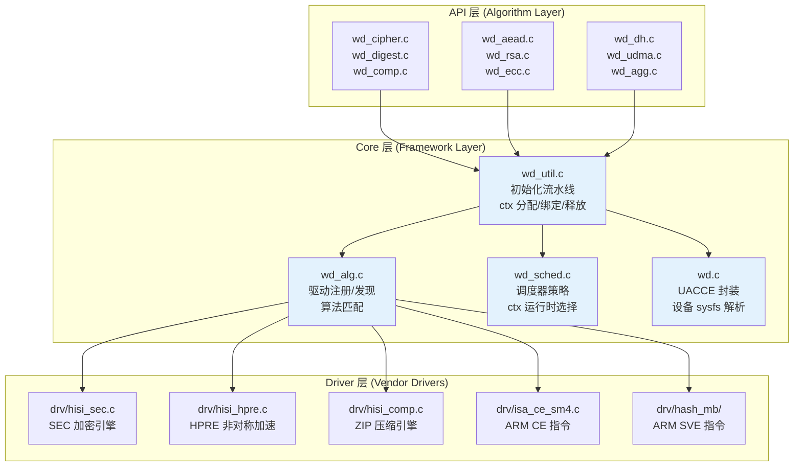

各层职责：

| 层次 | 文件 | 职责 |
|------|------|------|
| **API 层** | `wd_cipher.c`, `wd_digest.c` 等 | 暴露用户 API（init/alloc_sess/do_xxx/poll），将请求参数打包为驱动消息格式 |
| **Core 层** | `wd_util.c`, `wd_alg.c` | 初始化流水线编排、驱动生命周期管理、Context 分配与绑定、框架与调度器对接 |
| **Driver 层** | `drv/hisi_sec.c`, `drv/isa_ce_sm4.c` 等 | 硬件/指令的具体实现（send/recv/alloc_ctx），实现 `wd_alg_driver` 回调族 |

### 1.2 Core 层的职责边界

Core 层（框架层）是本文档的核心关注点，其职责是：

**做**：
- 驱动发现：扫描全局驱动注册链表 `alg_list_head`，按算法类型/任务类型过滤
- Context 分配：为每个驱动分配硬件队列或软件上下文
- 驱动绑定：将 ctx 与驱动关联（RR 方式）
- 驱动初始化：调用 `driver->init()`，保证每个唯一驱动只 init 一次
- 初始化流程编排：将 V1/V2 两条路径提炼为 4 Phase 标准框架
- 框架与调度器对接：在 session 创建时将兼容 ctx 集合注入调度器

**不做**：
- 不做调度决策——由调度器的 `pick_next_ctx` 决定
- 不直接操作硬件——通过驱动的 `send/recv` 回调间接操作
- 不管理用户 session 的生命周期——由 API 层管理

### 1.3 核心问题

UADK V1（2018）为 hisi_sec2 单设备设计，API 层用户自行管理上下文和调度器。随着鲲鹏 920/930 平台演进，多引擎（SEC/HPRE/ZIP）和 ARM CE/SVE 指令扩展出现，旧架构暴露出一个核心矛盾：

> **V1 单设备、用户管理资源的架构，无法满足 V2 多设备、多类型（HW+CE+SVE+SOFT）混合加速的需求。但 V1 API 已被大量用户使用，不能破坏向前兼容。**

框架层需要解决的具体问题是：**如何在不改变 V1 对外 API 的前提下，将两条完全不同的初始化路径统一为一条可扩展的流水线？**

### 1.4 新旧方案一句话

- **旧方案**（V1）：每个算法模块有两套独立的 init/uninit 函数对，入参语义完全不同（资源导向 vs 需求导向），ctx 所有权归属混乱，驱动硬编码加载
- **新方案**（当前）：初始化流程阶段化解构（4 Phase）+ 共享阶段函数 + V2 路径封装（`wd_init_attrs` + `wd_alg_attrs_init`）+ 两阶段算法兼容匹配

### 1.5 阅读指引

本文档聚焦**框架层（Core Layer）** 的设计。调度器的设计细节（哈希表、Segment 链表、7 种策略、idx_cache 等）已有独立文档 `wd_sched_design.md`，本文仅在第 7 章概要说明框架与调度器的对接关系。

---

## 第二章：旧方案在三层架构中的问题

### 2.1 问题来源与全景

UADK v2.10 代码审计识别出 **10 个框架层问题（P1-P10）** 和 **11 个调度器问题（P11-P21）**。这 21 个问题驱动了对整个框架的重构。调度器问题已在 `wd_sched_design.md` 中详细分析，本章聚焦框架层问题。

从这些问题中提炼出 **6 个设计目标（G1-G6）**：

| 目标 | 来源 | 含义 |
|------|------|------|
| **G1 向后兼容** | V1 用户依赖现有 `wd_cipher_init` API | 不能因重构破坏存量代码 |
| **G2 新设备类型可扩展** | 未来 NPU/GPU 等新设备 | `alg_dev_type` 枚举预留扩展位 |
| **G3 统一初始化** | P1 两套独立逻辑的维护成本 | 合并 init1/init2 的公共逻辑到同一流水线 |
| **G4 分层过滤** | init 与 session 之间存在信息差 | init 时按类型粗筛，session 时按算法细筛 |
| **G5 API 稳定** | 外部用户代码不能修改 | 对外函数签名保持不变 |
| **G6 调度器可扩展** | 不同业务需要不同调度策略 | 策略模式 + `sched_table[]` 可插拔 |

10 个框架层问题之间存在清晰的因果链：

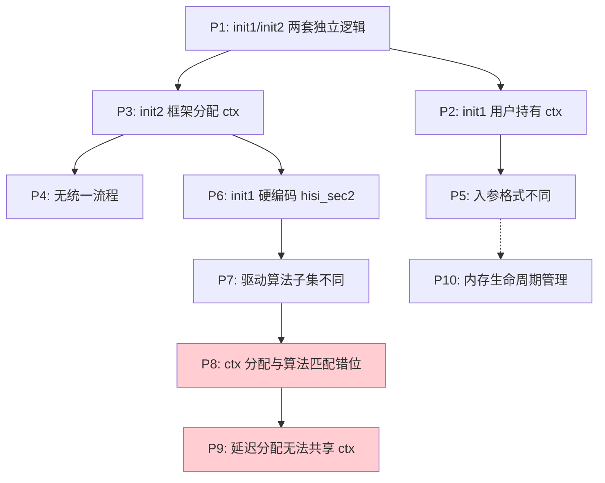

两条因果主线：

1. **P1 → P3 → P6 → P7 → P8 → P9**：初始化分裂 → 框架完全接管 ctx 分配 → 硬编码驱动 → 驱动算法子集不同 → ctx 分配与算法匹配错位 → 不能延迟分配因为无法共享 ctx 池
2. **P1 → P2 → P5**：初始化分裂 → init1 用户持有 ctx → init1/init2 入参完全不同

### 2.2 API 层问题：两套初始化路径并行（P1、P5）

每个算法模块存在两个入口：

```c
// V1 路径 (wd_cipher.c:410) — 资源导向
int wd_cipher_init(struct wd_ctx_config *config, struct wd_sched *sched)
{
    // 用户传入已分配的 ctx 队列和调度器
    // 框架只做校验和深拷贝
    ret = wd_cipher_common_init(config, sched, NULL);
}

// V2 路径 (wd_cipher.c:494) — 需求导向
int wd_cipher_init2_(char *alg, __u32 sched_type, int task_type,
                     struct wd_ctx_params *ctx_params)
{
    // 框架内部完成驱动发现、ctx 分配、调度器创建
    wd_alg_attrs_init(&wd_cipher_init_attrs);
}
```

| 维度 | init1 | init2 |
|------|-------|-------|
| ctx 来源 | `wd_ctx_config`（用户预分配） | `wd_ctx_params`（描述需求，框架分配） |
| 调度器 | `wd_sched`（用户提供） | `sched_type`（框架创建） |
| 算法 | 不指定，common_init 中用硬编码 | `char *alg` |
| 驱动 | 硬编码 `dlopen("libhisi_sec.so")` | `wd_dlopen_drv(NULL)` 批量加载 |
| 控制反转 | 用户掌控一切 | 框架接管一切 |

这种分裂的直接影响：

- 每个算法模块多出 **50-80 行**两套初始化代码
- 修复一个初始化 bug 需要在两处修改
- 两条路径的共同终点 `wd_<alg>_common_init()` 仅占总逻辑的一小部分——大部分代码在两条路径中各自独立实现

### 2.3 API 层问题：V1 路径硬编码驱动名（P6）

`wd_cipher_open_driver()` 根据 init_type 分叉：

```c
// wd_cipher.c:96
static int wd_cipher_open_driver(int init_type)
{
    if (init_type == WD_TYPE_V2) {
        wd_cipher_setting.dlh_list = wd_dlopen_drv(NULL);  // 批量加载
        return WD_SUCCESS;
    }
    // init1 分支:
    ret = wd_get_lib_file_path("libhisi_sec.so", lib_path, false);  // 硬编码
    wd_cipher_setting.dlhandle = dlopen(lib_path, RTLD_NOW);
    driver = wd_request_drv("cbc(aes)", false);  // 硬编码算法名
}
```

类似情况出现在 `wd_digest_open_driver()`（硬编码 `"sm3"` + `"libhisi_sec.so"`）、`wd_aead_open_driver()` 等所有算法模块。多驱动环境下（如同时存在 hisi_sec2 和 isa_ce_sm4），init1 无法利用非 SEC 硬件。

### 2.4 Core 层问题：初始化流程分裂（P2、P3、P4）

**V1 路径**：用户持有 ctx 所有权，框架仅拷贝。

```c
// wd_util.c:263 — wd_init_ctx_config
int wd_init_ctx_config(struct wd_ctx_config_internal *in, struct wd_ctx_config *cfg)
{
    // 直接拷贝用户 ctx 到内部结构，不做额外分配
    for (i = 0; i < cfg->ctx_num; i++)
        clone_ctx_to_internal(cfg->ctxs + i, ctxs + i);
}
```

**V2 路径**：框架完成完整的"发现→分配→调度器创建→初始化"链条：

```
wd_cipher_init2_()
  ├── wd_cipher_open_driver(WD_TYPE_V2)    // 批量加载驱动 .so
  ├── wd_ctx_param_init()                  // 确定 ctx 数量
  ├── wd_alg_attrs_init()                  // Phase 1 + Phase 2
  │    ├── Phase 1: wd_alg_drv_discover() // 驱动发现
  │    └── Phase 2: wd_alg_ctx_init()     // ctx 分配 + 调度器创建
  │         └── alg_init = wd_cipher_common_init()  // 内拷贝 + 消息池
  ├── wd_ctx_bind_drivers()                // Phase 2.5: 驱动绑定
  └── wd_alg_init_driver()                 // Phase 3: 驱动初始化
```

两条路径在执行阶段上不同，但遵循相同的 4 Phase 逻辑顺序。

### 2.5 Core 层问题：Context 分配时机矛盾（P7、P8、P9—"不可能三角"）

这是整个重构中最核心的设计取舍。

**矛盾**：init 时分配 ctx 和 session 时分配 ctx 各有不可放弃的优势和不可接受的代价。

```
选择 A — init 时分配 ctx 池：
  优点：多 session 共享 ctx 池，可叠加多设备算力
  缺点：init 时只知道算法类型（cipher/digest），不知道具体算法（cbc(aes)/ecb(sm4)），
        分配的 ctx 可能不兼容后续 session 的算法
  
选择 B — session 时分配 ctx：
  优点：算法兼容性绝对保障
  缺点：每个 session 独立分配 ctx，无法共享 ctx 池，无法叠加多设备算力
  
选择 C — 固定驱动/单设备：
  优点：实现简单
  缺点：单设备瓶颈，无降级能力，无法利用 CE 加速
```

**典型冲突场景**：系统有 hisi_sec（支持 AES+SM4）和 isa_ce_sm4（仅 SM4）两个驱动。

```
init 时绑定 hisi_sec → 分配 ctx[0..N] 全部绑定 hisi_sec
  session 创建 ecb(aes) → 成功 ✓
  session 创建 ecb(sm4) → 成功 ✓（hisi_sec 支持 SM4）

init 时绑定 isa_ce_sm4 → 分配 ctx[0..N] 全部绑定 isa_ce_sm4
  session 创建 ecb(aes) → 失败 ✗（isa_ce_sm4 不支持 AES）
  session 创建 ecb(sm4) → 成功 ✓
```

**选定方案**（方案 A 的改进版）：init 时为所有驱动分配 ctx 池 → session 时 `wd_get_compat_ctxs()` 按具体算法过滤 → 调度器在兼容子集中选择。

选择此方案的三个理由：

1. ctx 池共享的收益（多 session 叠加吞吐量）超过了资源浪费的成本（某些 ctx 在特定场景下空闲）
2. 混合加速场景（如 SEC 满负荷时 CE 接管）要求 ctx 池必须共享
3. 引入两阶段匹配（init 粗筛 → session 细筛）解决了兼容性问题，且兼容性检查在 session 创建时一次性完成，不影响运行时热路径

### 2.6 Core 层问题：内存生命周期冲突（P10）

多层数据结构之间生命周期管理复杂：

```
wd_ctx_h (wd_request_ctx 分配)
  → wd_ctx (用户层包装)
    → wd_ctx_internal (框架内部拷贝)
      → driver->init 中的驱动私有数据
```

关键冲突点：存在两条释放路径。

```c
// 路径一: wd_alg_uninit_driver (wd_util.c:1650)
void wd_alg_uninit_driver(struct wd_ctx_config_internal *config)
{
    for (i = 0; i < config->ctx_num; i++)
        wd_ctx_uninit_driver(config, &config->ctxs[i]);
    // 内部调用 wd_clear_ctx_config() 释放 ctx 内部结构
}

// 路径二: wd_alg_attrs_uninit (wd_util.c:2670)
void wd_alg_attrs_uninit(struct wd_init_attrs *attrs)
{
    wd_alg_ctx_uninit(attrs);  // 释放 ctx_config 和 ctxs
}
```

若在 V2 uninit 过程中两条路径均被调用且释放顺序不当，可能出现双重释放或 use-after-free。当前通过小心编排调用顺序避免问题，但该状态依赖调用顺序而非设计保证。

此外，`drv_array` 的归属权不明确：`wd_alg_drv_discover()` 分配，但谁负责释放？在 V1 路径下 `drv_array` 通过 `wd_get_drv_array("cipher", TASK_HW, "hisi_sec2")` 在 `wd_cipher_init()` 中分配，存储在 `config_internal.drv_array` 中；V2 路径下存储在 `attrs->drv_array` 中。释放责任不统一。

**截至当前版本**，8 个算法模块（comp、digest、aead、rsa、dh、ecc、agg、join_gather、udma）仍保留旧的 `wd_ctx_drv_config()` 调用——该函数在 Phase 2.5 的 `wd_ctx_bind_drivers()` 出现后已是冗余代码。

### 2.7 对开发者的意义

老问题的本质是**设计假设的过时**——单设备、连续 ctx、固定拓扑的假设在多设备异构场景下全部失效。

- 如果遇到"算法不支持"错误，首先检查是否属于 P8 症状：init 时绑定的驱动不支持 session 所需的算法
- `wd_ctx_drv_config()` 的残留调用可以安全删除——Phase 2.5 已完成相同的绑定工作
- 内存释放的"按顺序保证安全"是脆弱的设计，新增代码时应尽量避免依赖释放顺序

---

## 第三章：新方案设计总览

### 3.1 问题驱动的方案矩阵

| 旧问题 | 新方案核心设计 | 解决原理 |
|--------|--------------|---------|
| P1/P5 两套 init 入口、入参不同 | V2 路径通过 `wd_init_attrs` 封装参数 + V1/V2 共享 Phase 2.5/3 函数 | 两条路径各自组装参数，但核心阶段函数复用 |
| P2/P3 ctx 所有权归属混乱 | V1 路径直接调用 `wd_cipher_common_init()`（用户提供 ctx），V2 路径通过 `wd_alg_ctx_init()` 内部 `alloc_ctx` 分配 | 两条路径的 ctx 来源不同，但绑定和初始化阶段共享同一份代码 |
| P4 无统一流程 | 4 Phase 标准化阶段分解 | 提取各阶段共享函数，V2 用 `wd_alg_attrs_init()` 封装 Phase 1+2 |
| P6 硬编码驱动名 | V1 调用 `wd_get_drv_array()` 时传入 `"hisi_sec2"`，V2 传入 `NULL` | 同一函数通过参数分化适应两条路径的驱动发现需求 |
| P7/P8/P9 "不可能三角" | 两阶段算法兼容匹配 | init 分配 ctx 池 + session 时 `wd_get_compat_ctxs()` 过滤 |
| P10 内存生命周期 | 统一释放路径 LIFO | 按"Phase 3 → Phase 2.5 → Phase 2 → Phase 1"逆序释放 |
| P11-P21 调度器问题 | 哈希表 + Segment + idx_cache | 见独立文档 `wd_sched_design.md` |

### 3.2 新方案的核心变化

新方案不是引入某个统一结构体，而是对初始化流程进行了**阶段化解构（Phase Decomposition）**：

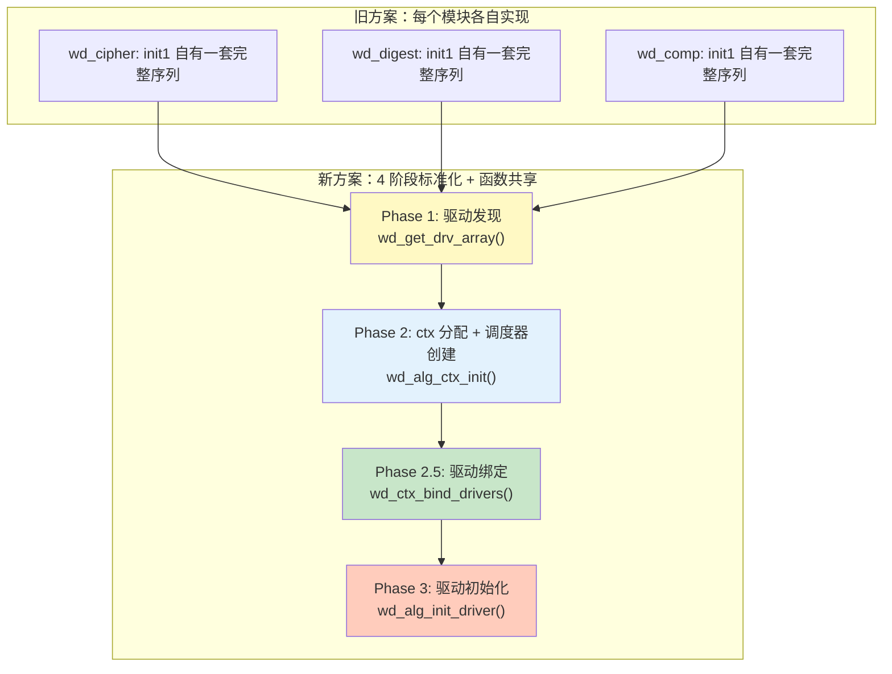

核心变化有三：

1. **阶段标准化**：将初始化分解为 4 个标准阶段（驱动发现 → ctx 分配 → 驱动绑定 → 驱动初始化），V1 和 V2 路径都遵循这个逻辑顺序
2. **函数共享**：各阶段的核心函数（`wd_get_drv_array`、`wd_ctx_bind_drivers`、`wd_alg_init_driver`）被 V1 和 V2 路径共享调用，消除重复代码
3. **V2 封装**：V2 路径将 Phase 1+2 封装在 `wd_alg_attrs_init()` 中，配合 `wd_init_attrs` 作为参数载体；V1 路径直接调用各阶段函数

### 3.3 三层架构下的变化

| 层次 | 旧方案 | 新方案 |
|------|--------|--------|
| **API 层** | 每个算法模块维护两套独立的 init 序列 | V2 路径构造 `wd_init_attrs` 后调用 `wd_alg_attrs_init()`；V1 路径直接调用各阶段共享函数 |
| **Core 层** | 分散的初始化逻辑，缺乏统一的阶段划分 | 4 阶段标准化分解，核心函数（`wd_get_drv_array`/`wd_ctx_bind_drivers`/`wd_alg_init_driver`）被 V1 和 V2 共享 |
| **Driver 层** | 仅提供 init/exit/send/recv 回调 | 新增 `alloc_ctx`/`free_ctx` 回调，驱动完全自管资源 |

### 3.4 设计目标达成矩阵

| 目标 | 达成状态 | 实现机制 |
|------|---------|---------|
| **G1 向后兼容** | ✅ | V1 路径结构保持不变（直接调用阶段函数），V2 路径通过新的封装函数实现 |
| **G2 新设备可扩展** | ⚠️ 部分 | `alg_dev_type` 枚举已预留 NPU(0x4)/GPU(0x5)，但驱动层尚无处理逻辑 |
| **G3 统一初始化** | ✅ | 4 阶段标准化分解，V2 路径使用 `wd_alg_attrs_init()` 封装 Phase 1+2（但 Phase 2 仍使用 `switch(task_type)` 分支——待优化） |
| **G4 分层过滤** | ✅ | init 按类型分配 ctx 池 + session 时 `wd_drv_alg_support()` + `wd_sched_set_param()` 按算法过滤 |
| **G5 API 稳定** | ✅ | 所有对外接口签名不变，改动限定在内部结构和函数范围内 |
| **G6 调度器可扩展** | ✅ | 策略模式 + `sched_table[]` 已注册 7 种策略 |

### 3.5 对开发者的意义

新方案不是一个孤立的优化，而是对旧方案所有已知问题的系统性回复：

- V2 路径的初始化序列已标准化：`wd_alg_attrs_init()`(Phase 1+2) → `wd_ctx_bind_drivers()`(Phase 2.5) → `wd_alg_init_driver()`(Phase 3)
- V1 路径保持直接调用各阶段函数：`wd_<alg>_common_init()` → `wd_get_drv_array()` → `wd_ctx_bind_drivers()` → `wd_alg_init_driver()`
- 两阶段匹配是理解 ctx 分配策略的核心：兼容性检查不在热路径上（仅在 session 创建时），因此不会影响运行时性能

---

## 第四章：V1 和 V2 初始化路径的并行走线

### 4.1 旧问题

V1 和 V2 的入参完全不同，但需要遵循相同的 4 阶段逻辑顺序：

```c
// V1 入参 — "我有这些资源，帮我初始化"
int wd_cipher_init(struct wd_ctx_config *config, struct wd_sched *sched);

// V2 入参 — "我要这个算法，帮我准备好一切"
int wd_cipher_init2_(char *alg, __u32 sched_type, int task_type,
                     struct wd_ctx_params *ctx_params);
```

旧方案中，两条路径各自完整实现初始化序列，缺少标准化的阶段划分和函数共享。每个算法模块的两套 init 之间存在大量重复逻辑。

### 4.2 新方案设计

新方案的关键洞察是：**V1 和 V2 尽管入参不同，但都遵循同一套 4 阶段逻辑顺序**。通过将初始化过程标准化为 4 个阶段、并提取出各阶段的共享函数，两条路径可以各自调用这些函数而无需重复实现。

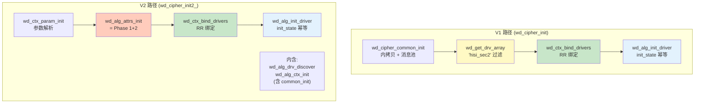

四条共享的线上"锚点"函数：

| 函数 | 被谁调用 | V1 的参数 | V2 的参数 |
|------|---------|-----------|-----------|
| `wd_get_drv_array()` | V1 直接调用 | `"cipher", TASK_HW, "hisi_sec2"` | 通过 `wd_alg_drv_discover` 调用，固定 `NULL` |
| `wd_ctx_bind_drivers()` | V1+V2 直接调用 | `config_internal` | `config_internal` |
| `wd_alg_init_driver()` | V1+V2 直接调用 | `config_internal` | `config_internal` |
| `wd_<alg>_common_init()` | V1 直接调用 / V2 通过 `alg_init` 回调调用 | 用户提供的 `config` 和 `sched` | `wd_alg_ctx_init` 内部创建的 `ctx_config` 和 `sched` |

### 4.3 V1 路径详解

V1 路径的调用序列：

```c
int wd_cipher_init(struct wd_ctx_config *config, struct wd_sched *sched)
{
    // 状态机：UNINIT → INITING
    ret = wd_alg_try_init(&wd_cipher_setting.status);
    if (ret) return ret;

    // 参数校验
    ret = wd_init_param_check(config, sched);
    if (ret) goto out_clear_init;

    // 打开驱动（硬编码 hisi_sec2）
    ret = wd_cipher_open_driver(WD_TYPE_V1);
    if (ret) goto out_clear_init;

    /* ═══ Phase 1: Internal copy ═══ */
    ret = wd_cipher_common_init(config, sched, NULL);
    if (ret) goto out_close_driver;

    /* ═══ Phase 2: Driver discovery ═══ */
    ret = wd_get_drv_array("cipher", TASK_HW, "hisi_sec2",
            &wd_cipher_setting.config.drv_array, &drv_count);
    if (ret) goto out_free_drv_array;

    /* ═══ Phase 2.5: RR bind drivers ═══ */
    ret = wd_ctx_bind_drivers(&wd_cipher_setting.config,
            wd_cipher_setting.config.drv_array, drv_count);
    if (ret) goto out_common_uninit;

    /* ═══ Phase 3: Driver initialization ═══ */
    ret = wd_alg_init_driver(&wd_cipher_setting.config);
    if (ret) goto out_unbind_drivers;

    // 状态机：INITING → INIT
    wd_alg_set_init(&wd_cipher_setting.status);
    return 0;
}
```

V1 路径的四个阶段按顺序执行，每个阶段都有独立的错误处理标签（`out_close_driver`、`out_common_uninit`、`out_unbind_drivers`）。值得注意的是 V1 中 Phase 1（common_init，即内拷贝）发生在 Phase 2（驱动发现）之前——因为 V1 的用户已经提供了 ctx 和 sched，不需要等待驱动发现。

### 4.4 V2 路径详解

V2 路径的调用序列：

```c
int wd_cipher_init2_(char *alg, __u32 sched_type, int task_type,
                      struct wd_ctx_params *ctx_params)
{
    // 状态机 + 参数校验 + 驱动批量加载
    state = wd_alg_try_init(&wd_cipher_setting.status);
    flag = wd_cipher_alg_check(alg);
    state = wd_cipher_open_driver(WD_TYPE_V2);

    while (ret != 0) {
        // 解析 ctx 参数（环境变量 > 用户参数 > 驱动默认值）
        ret = wd_ctx_param_init(&cipher_ctx_params, ctx_params, ...);
        if (ret == -WD_EAGAIN) continue;

        // 填充 wd_init_attrs
        wd_cipher_init_attrs.alg = alg;
        wd_cipher_init_attrs.sched_type = sched_type;
        wd_cipher_init_attrs.task_type = task_type;
        wd_cipher_init_attrs.ctx_params = &cipher_ctx_params;
        wd_cipher_init_attrs.alg_init = wd_cipher_common_init;
        wd_cipher_init_attrs.alg_poll_ctx = wd_cipher_poll_ctx;

        /* ═══ Phase 1 + Phase 2 (通过 wd_alg_attrs_init 封装) ═══ */
        ret = wd_alg_attrs_init(&wd_cipher_init_attrs);
        if (ret == -WD_ENODEV) {
            wd_ctx_param_uninit(&cipher_ctx_params);
            continue;  // 设备未就绪，重试
        }
    }

    /* ═══ Phase 2.5: RR bind drivers ═══ */
    ret = wd_ctx_bind_drivers(&wd_cipher_setting.config,
            wd_cipher_init_attrs.drv_array, wd_cipher_init_attrs.drv_count);

    /* ═══ Phase 3: Driver initialization ═══ */
    ret = wd_alg_init_driver(&wd_cipher_setting.config);

    wd_alg_set_init(&wd_cipher_setting.status);
    return 0;
}
```

V2 路径的关键差异：

1. **参数解析阶段**：在 Phase 1 之前先调用 `wd_ctx_param_init()` 从环境变量、用户参数、驱动默认值三级来源解析 ctx 参数
2. **重试循环**：`while (ret != 0)` 循环处理 `-WD_ENODEV`（设备未就绪）和 `-WD_EAGAIN`（资源不足），无退避延迟
3. **wd_init_attrs 的作用**：仅作为 V2 路径内部传递参数的局部结构体，将 `alg`、`sched_type`、`task_type`、`ctx_params`、`alg_init` 等参数打包传递给 `wd_alg_attrs_init()`

### 4.5 wd_init_attrs 结构体

`wd_init_attrs` 是 V2 路径专用的内部参数载体，不是 V1/V2 的统一桥梁：

```c
// wd_alg_common.h:201
struct wd_init_attrs {
    __u32 sched_type;                    // 调度策略类型
    __u32 task_type;                     // TASK_HW / TASK_MIX / TASK_INSTR
    char alg[CRYPTO_MAX_ALG_NAME];       // 算法名称（如 "cbc(aes)"）

    /* 输出：Phase 2 完成后填充 */
    struct wd_sched *sched;              // 调度器实例
    struct wd_ctx_config *ctx_config;    // 用户可见的 ctx 配置

    /* 输入：由 init2_ 函数设置 */
    struct wd_ctx_params *ctx_params;    // ctx 分配参数
    wd_alg_init alg_init;                // common_init 回调
    wd_alg_poll_ctx alg_poll_ctx;        // poll 回调

    /* 内部状态 */
    struct wd_ctx_config_internal *ctx_config_internal;
    struct wd_alg_driver **drv_array;    // Phase 1 发现的驱动（输出）
    __u32 drv_count;
};
```

每个算法模块声明一个全局的 `static struct wd_init_attrs` 实例（如 `wd_cipher_init_attrs`、`wd_digest_init_attrs`），在 `init2_` 函数中填充字段后传给 `wd_alg_attrs_init()`。

### 4.6 wd_alg_attrs_init 的内部实现

`wd_alg_attrs_init()` 封装 Phase 1（驱动发现）和 Phase 2（ctx 分配 + 调度器创建 + common_init）：

```c
int wd_alg_attrs_init(struct wd_init_attrs *attrs)
{
    if (!attrs || !attrs->ctx_params)
        return -WD_EINVAL;

    /* Phase 1: Driver discovery (pure query, no side effects) */
    ret = wd_alg_drv_discover(attrs);
    if (ret) return ret;

    /* Phase 2: ctx allocation + internal copy + scheduler */
    ret = wd_alg_ctx_init(attrs);
    if (ret) {
        wd_alg_drv_undiscover(attrs);
        return ret;
    }

    return 0;
}
```

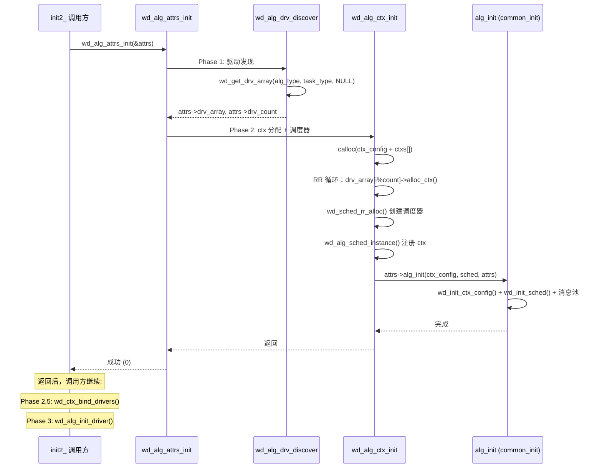

### 4.7 对比表

| 维度 | V1 路径 | V2 路径 |
|------|---------|---------|
| 入口 | `wd_<alg>_init(config, sched)` | `wd_<alg>_init2_(alg, sched_type, task_type, ctx_params)` |
| ctx 来源 | 用户预分配后传入 | 框架内部调用 `drv->alloc_ctx()` 分配 |
| 驱动发现 | `wd_get_drv_array()` 直接调用，硬编码 `"hisi_sec2"` | `wd_alg_drv_discover()`（封装 `wd_get_drv_array(NULL)`） |
| Phase 1+2 封装 | 无，直接调用各函数 | `wd_alg_attrs_init()` + `wd_init_attrs` |
| 参数解析 | 无（用户已准备好所有参数） | `wd_ctx_param_init()` 三级解析 |
| 重试机制 | 无 | `while(ret != 0)` 循环（`-WD_ENODEV`/`-WD_EAGAIN`） |
| Phase 2.5 | `wd_ctx_bind_drivers()` | `wd_ctx_bind_drivers()` ← **共享** |
| Phase 3 | `wd_alg_init_driver()` | `wd_alg_init_driver()` ← **共享** |

### 4.8 对开发者的意义

- V1 和 V2 路径虽然入参不同，但 Phase 2.5 和 Phase 3 的函数是**完全共享**的。这意味着驱动绑定和驱动初始化的行为在两条路径中完全一致
- `wd_init_attrs` 是 V2 路径特有的结构体，V1 路径不使用它。不要试图用 `wd_init_attrs` 统一 V1 和 V2 的参数传递
- 新增算法模块时，V2 路径遵循固定的四步模式：构造 attrs → `wd_alg_attrs_init()` → `wd_ctx_bind_drivers()` → `wd_alg_init_driver()`
- V2 的重试循环无退避延迟（`while(ret != 0)`），若硬件不存在将永久循环——建议在调用前确认硬件就绪

---

## 第五章：4 Phase 初始化流水线

### 5.1 旧方案问题

旧方案中每个算法模块的初始化路径各自为政。以 V2 路径为例：

```c
// wd_cipher_init2_ 内部（重构前）
wd_alg_drv_bind(task_type, alg);          // 绑定驱动
wd_ctx_param_init(...);                   // 参数初始化
wd_alg_attrs_init(&wd_cipher_init_attrs); // 进入 4 Phase

// wd_alg_attrs_init 内部（旧实现，仍有残留）
switch (driver_type) {
case UADK_ALG_HW:
    wd_alg_hw_ctx_init(attrs);    // 旧函数，硬件专用
case UADK_ALG_CE_INSTR:
    wd_alg_other_ctx_init(attrs); // 旧函数，非硬件专用
}
```

三条分支使用三个不同的旧函数，它们做着本质相同的工作（分配 ctx + 创建调度器），但实现细节不同。这种"殊途同归"的设计使得：

- 修复一个初始化 bug 需要在三处修改
- CE 路径和 HW 路径的行为差异难以追踪
- 新增 calc_type（如 NPU）需要再添加一个分支

### 5.2 新方案设计：4 Phase 总览

V1 和 V2 两条路径的初始化均遵循相同的 4 Phase 逻辑顺序，但实现组织方式不同：

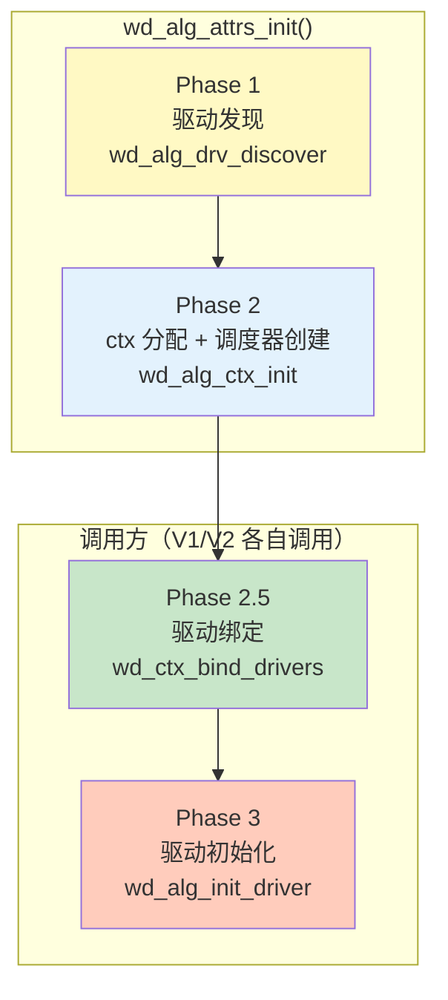

**V2 路径**：`wd_alg_attrs_init()` 封装 Phase 1+2，Phase 2.5 和 Phase 3 在调用方显式调用。

**V1 路径**：不使用 `wd_alg_attrs_init()`，直接调用各阶段函数。且 V1 中 common_init（内拷贝）发生在 Phase 2 驱动发现之前。

各阶段的失败模式完全不同，这是划分阶段的关键依据：

```
Phase 1 失败 → 驱动未加载或算法不匹配 → 检查 uadk.cnf 和硬件就绪
Phase 2 失败 → 资源不足 → V2 有重试循环，可重试
Phase 2.5 失败 → 编程错误 → 不应重试
Phase 3 失败 → 驱动内部错误 → 检查驱动 log
```

### 5.3 Phase 1：驱动发现

**核心函数**：`wd_alg_drv_discover()` → `wd_get_drv_array()`

**职责**：扫描全局驱动注册链表 `alg_list_head`，按算法类型、任务类型、驱动名过滤，返回去重后的驱动指针数组。

**关键流程**：

```c
int wd_alg_drv_discover(struct wd_init_attrs *attrs)
{
    char alg_type[CRYPTO_MAX_ALG_NAME] = {0};
    int ret;

    // 将 "cbc(aes)" → "cipher"
    wd_get_alg_type(attrs->alg, alg_type);

    // drv_name_filter 固定为 NULL（不过滤驱动名）
    // V1 路径的精确过滤在 wd_cipher_init 中直接调用 wd_get_drv_array 实现
    ret = wd_get_drv_array(alg_type, attrs->task_type, NULL,
                           &attrs->drv_array, &attrs->drv_count);
}
```

**V1 路径的驱动发现**：V1 直接在 `wd_cipher_init()` 中调用 `wd_get_drv_array()`，传入 `"hisi_sec2"` 精确过滤：

```c
// wd_cipher.c:435 — V1 直接调用，硬编码驱动名过滤
ret = wd_get_drv_array("cipher", TASK_HW, "hisi_sec2",
                       &wd_cipher_setting.config.drv_array, &drv_count);
```

**关键数据结构**：

```c
// wd_alg.h:201 — 驱动节点
struct wd_drv_node {
    char drv_name[DEV_NAME_LEN];        // "hisi_sec"
    char alg_type[ALG_NAME_SIZE];       // "cipher"
    int priority;                       // 优先级（HW > CE > SOFT）
    int calc_type;                      // UADK_ALG_HW / CE_INSTR / SVE_INSTR / SOFT
    int refcnt;                         // 跨模块引用计数
    struct wd_alg_driver *drv;          // 驱动实现指针
    struct wd_alg_entry algs[MAX_DRV_ALG_NUM];  // 支持的算法列表
    int alg_count;
    struct wd_drv_node *next;           // 链表指针
};
```

驱动通过 `wd_alg_driver_register()` 注册到链表中。`wd_get_drv_array()` 遍历链表，按以下条件过滤：

1. `alg_type` 匹配（如 "cipher"）
2. `task_type` 匹配（TASK_HW 只返回 HW 驱动，TASK_MIX 返回 HW+CE+SOFT 等）
3. `drv_name_filter` 如果非 NULL，精确匹配驱动名

**失败模式**：无匹配驱动时返回 `-WD_ENODEV`。V2 路径在此情况下进入重试循环（等待硬件就绪），V1 路径要求 `hisi_sec2` 驱动必须存在。

### 5.4 Phase 2：Context 分配 + 内部拷贝 + 调度器创建

**核心函数**：`wd_alg_ctx_init()`

**职责**：为每个 ctx slot 调用对应驱动的 `alloc_ctx()`，创建调度器并注册 ctx 范围，执行算法模块的 common_init。

**完整流程**：

```c
int wd_alg_ctx_init(struct wd_init_attrs *attrs)
{
    // 1. 计算总 ctx 数（sync + async）
    for (i = 0; i < ctx_params->op_type_num; i++) {
        sync_num += ctx_params->ctx_set_num[i].sync_ctx_num;
        async_num += ctx_params->ctx_set_num[i].async_ctx_num;
    }
    total_ctx_num = sync_num + async_num;

    // 2. 分配 ctx_config 和 ctxs 数组
    ctx_config = calloc(1, sizeof(*ctx_config));
    ctx_config->ctxs = calloc(total_ctx_num, sizeof(struct wd_ctx));

    // 3. RR 轮询驱动分配 ctx
    for (ctx_idx = 0; ctx_idx < total_ctx_num; ctx_idx++) {
        drv_idx = ctx_idx % attrs->drv_count;
        drv = attrs->drv_array[drv_idx];
        ret = drv->alloc_ctx(attrs->alg, &dparams, &ctx);
        ctx_config->ctxs[ctx_idx].ctx = ctx;
    }

    // 4. 分配调度器
    attrs->sched = wd_sched_rr_alloc(attrs->sched_type, ...);

    // 5. 将 ctx 范围注册到调度器
    wd_alg_sched_instance(attrs->sched, ctx_config, ctx_params);

    // 6. 调用算法模块 common_init（wd_init_ctx_config + wd_init_sched + 消息池）
    attrs->alg_init(ctx_config, attrs->sched, attrs);
}
```

**RR 分配规则**：`ctxs[i]` 由 `drv_array[i % drv_count]` 分配。在单驱动场景下（V1 只有 hisi_sec2），所有 ctx 由同一驱动分配。在多驱动场景下，ctx 均匀分布在所有驱动上。

**关键设计**：`ctxs[i].drv` 在 Phase 2 完成后仍为 NULL。实际的驱动指针赋值在 Phase 2.5 中完成。这意味着：

- Phase 2 输出的 ctx 只有硬件句柄，没有驱动关联
- Phase 2.5 将驱动指针写入 ctxs[i].drv，这是整个生命周期中唯一一次写入
- 之后 `ctxs[i].drv` 只读，无需锁保护

**失败模式**：`drv->alloc_ctx()` 失败返回 `-WD_EAGAIN`（资源暂不可用）。V2 路径在外层 `while (ret != 0)` 循环中重试，重新调用 `wd_ctx_param_init()` 调整参数。

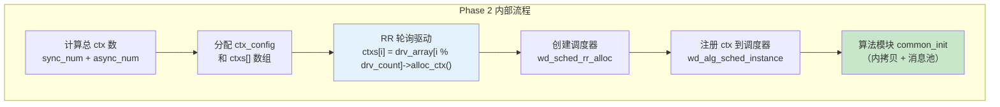

### 5.5 Phase 2.5：驱动绑定

**核心函数**：`wd_ctx_bind_drivers()`

**职责**：以 Round-Robin 方式将驱动指针赋值到每个 ctx，构建 `drv_region[]` 元数据，处理 HW 驱动的 fallback 注册。

```c
int wd_ctx_bind_drivers(struct wd_ctx_config_internal *config,
                         struct wd_alg_driver **drv_array, __u32 drv_count)
{
    for (i = 0; i < config->ctx_num; i++) {
        if (drv_count == 1) {
            config->ctxs[i].drv = drv_array[0];
        } else {
            config->ctxs[i].drv = drv_array[i % drv_count];
        }
        config->ctxs[i].ctx_type = config->ctxs[i].drv->calc_type;

        // HW 驱动需要软算 fallback
        if (config->ctxs[i].ctx_type == UADK_ALG_HW) {
            drv = config->ctxs[i].drv;
            if (!drv->fallback)
                drv->fallback = (handle_t)wd_request_drv(config->alg_name,
                                                          ALG_DRV_SOFT);
        }
    }

    // 缓存驱动数组供 session 查询
    config->drv_array = drv_array;
    config->drv_count = drv_count;

    // 去重引用计数递增（相同驱动只 +1）
    wd_alg_drv_ref_inc(drv_array, drv_count);
}
```

**设计决策：为什么是 RR 而非加权？**

初始化阶段 workload 特征不可知——无法预判用户主要使用 AES 还是 SM4、加密操作多还是解密操作多。加权分配需要 profiling 数据支持，初始化阶段不具备。代价是某些驱动分配的 ctx 可能闲置（如 isa_ce_sm4 的 ctx 在纯 AES 场景下空闲），这是一个"浪费资源换取通用性"的取舍。

**设计决策：为什么 Phase 2.5 独立为一个阶段？**

Phase 2（ctx 分配）和 Phase 2.5（驱动绑定）的失败模式不同：

- Phase 2 失败源于硬件资源不足（设备未就绪、队列已满），可通过减少 ctx 数量重试恢复
- Phase 2.5 失败源于软件状态错误（驱动与算法不匹配、驱动注册异常），属于编程错误不应重试

合并为一个阶段将使错误处理逻辑纠缠不清。

### 5.6 Phase 3：驱动初始化

**核心函数**：`wd_alg_init_driver()`

**职责**：遍历所有 ctx，对每个 ctx 调用 `wd_ctx_init_driver()`，确保每个唯一驱动只 init 一次。

```c
int wd_alg_init_driver(struct wd_ctx_config_internal *config)
{
    for (i = 0; i < config->ctx_num; i++) {
        if (!config->ctxs[i].ctx)
            continue;
        ret = wd_ctx_init_driver(config, &config->ctxs[i]);
        if (ret)
            goto init_err;
    }
    return 0;
}
```

`wd_ctx_init_driver()` 内部通过 `driver->init_state` 标志做幂等守卫：

```c
static int wd_ctx_init_driver(struct wd_ctx_config_internal *config,
                               struct wd_ctx_internal *ctx)
{
    struct wd_alg_driver *drv = ctx->drv;

    if (drv->init_state)  // 已经 init 过，跳过
        return 0;

    drv->priv = calloc(1, drv->priv_size);
    ret = drv->init(config, drv->priv);
    if (ret)
        return ret;

    drv->init_state = 1;
    return 0;
}
```

`init_state` 标志的关键作用：在多驱动场景下，一个驱动管理多个 ctx，但只需要初始化一次。`init_state` 在首次 `init` 成功后置 1，后续所有 ctx 的 `wd_ctx_init_driver()` 直接返回 0。

### 5.7 对比表

| 维度 | 旧方案 | 新方案 |
|------|--------|--------|
| 入口 | 每个算法模块各自为政 | `wd_alg_attrs_init()` 唯一入口 |
| Phase 1 | 硬编码 dlopen 或 `wd_alg_drv_bind` | `wd_get_drv_array()` 全局链表扫描 |
| Phase 2 | `switch(task_type)` 三条分支 | `wd_alg_ctx_init()` 统一路径 |
| Phase 2.5 | 各模块调用 `wd_ctx_drv_config()` | `wd_ctx_bind_drivers()` 统一绑定 |
| Phase 3 | 无去重保护 | `init_state` 标志幂等守卫 |
| 错误恢复 | 各路径自行处理 | 每阶段明确失败模式 + V2 重试循环 |

### 5.8 对开发者的意义

遇到初始化失败时，根据发生在哪个 Phase 判断原因和恢复策略：

```
Phase 1 失败 → 驱动未加载
   检查点: uadk.cnf 是否配置正确? /sys/class/uacce/ 下是否有设备?

Phase 2 失败 → 资源不足
   检查点: ctx_params 中请求的 ctx 数量是否超过硬件队列深度?
   V2 有重试循环，检查 retry 是否因其他原因被阻断

Phase 2.5 失败 → 编程错误
   检查点: drv_array 是否为空? drv_count 是否为 0?

Phase 3 失败 → 驱动内部错误
   检查点: 查看驱动 init 回调的返回值，检查 MMIO 映射是否正常
```

---

## 第六章：两阶段算法兼容匹配

### 6.1 旧问题

P7/P8/P9 构成了一个"不可能三角"——三个需求无法同时满足：

```
需求一：ctx 池共享（多 session 共享，叠加算力）
需求二：算法兼容（session 的 ctx 必须支持目标算法）
需求三：init 时分配（ctx 在初始化阶段统一分配）
```

三个需求两两相容但三者互斥：

```
共享 ctx + 算法兼容 → 需要在 session 时替换 ctx（当前方案）
共享 ctx + init 分配 → 无法保障所有 session 的算法兼容性
算法兼容 + init 分配 → 每个 session 单独分配 ctx（无法共享）
```

旧方案中，`wd_drv_alg_support()` 只检查单个驱动是否支持算法，不遍历全局驱动链表：

```c
// wd_alg.c 旧实现 — 只查单一驱动
bool wd_drv_alg_support(const char *alg_name, struct wd_alg_driver *drv)
{
    // 只检查 drv->algs[] 中是否有 alg_name
    // 如果该驱动不支持 alg_name，即使其他驱动支持也返回 false
}
```

### 6.2 新方案设计

两阶段算法兼容匹配将 ctx 分配和算法匹配拆分为两个独立的阶段：

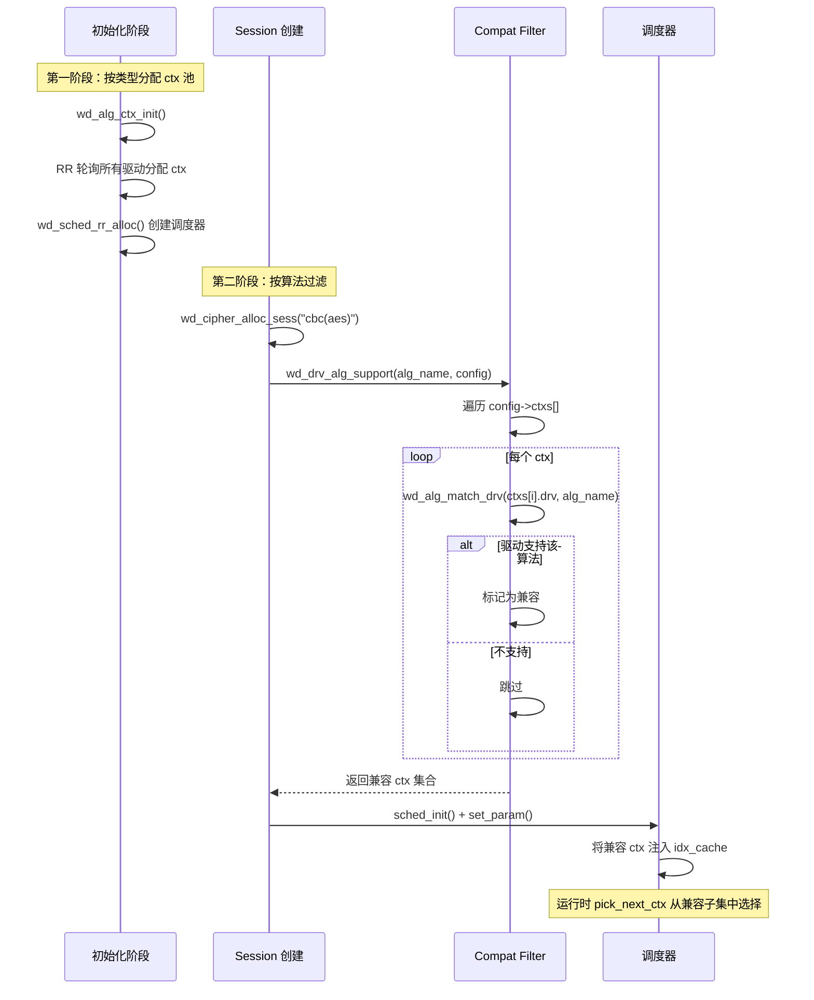

**第一阶段（初始化时）**：

- 通过 `wd_alg_ctx_init()` 分配覆盖全部驱动类型的 ctx 池
- 每个驱动按 RR 方式分配到 ctx slots
- ctxs[i].drv 指针在 Phase 2.5 设置，ctxs[i].ctx_type 标明驱动类型（HW/CE/SVE/SOFT）

**第二阶段（session 创建时）**：

- `wd_<alg>_alloc_sess()` 调用 `wd_drv_alg_support()` 检查至少有一个 ctx 支持目标算法
- `wd_sched_set_param()` 注入算法名称和 ctx 指针，触发兼容性过滤
- 调度器将兼容 ctx 注入 session 的 idx_cache
- 运行时 `pick_next_ctx` 仅从兼容子集中选择

### 6.3 wd_<alg>_alloc_sess 完整路径

以 `wd_cipher_alloc_sess()` 为例：

```c
handle_t wd_cipher_alloc_sess(struct wd_cipher_sess_setup *setup)
{
    sess->alg_name = wd_cipher_alg_name[setup->alg][setup->mode];

    // 第一步：检查至少有一个 ctx 的驱动支持该算法
    ret = wd_drv_alg_support(sess->alg_name, &wd_cipher_setting.config);
    if (!ret) {
        WD_ERR("failed to support this algorithm: %s!\n", sess->alg_name);
        goto free_sess;
    }

    // 第二步：调度器创建 session key
    sess->sched_key = wd_cipher_setting.sched.sched_init(
        wd_cipher_setting.sched.h_sched_ctx, setup->sched_param);

    // 第三步：注入兼容过滤参数
    struct wd_sched_params params;
    params.alg_name = sess->alg_name;
    params.ctxs = wd_cipher_setting.config.ctxs;
    wd_cipher_setting.sched.set_param(
        wd_cipher_setting.sched.h_sched_ctx,
        sess->sched_key, &params);

    return (handle_t)sess;
}
```

`wd_drv_alg_support()` 的新实现遍历 `config->ctxs[]`，不仅检查 ctx 的 `drv` 是否支持算法，还检查 `ctx_type` 与算法类型的匹配：

```c
bool wd_drv_alg_support(const char *alg_name,
                         struct wd_ctx_config_internal *config)
{
    for (i = 0; i < config->ctx_num; i++) {
        drv = config->ctxs[i].drv;
        if (wd_alg_match_drv(drv, alg_name))
            return true;  // 至少有一个 ctx 的驱动支持该算法
    }
    return false;
}
```

### 6.4 为什么不在 init 时直接分配兼容 ctx

核心原因：**信息差**。

```
init 时知道:      算法类型 = cipher
session 时知道:   具体算法 = cbc(aes)
```

init 时无法知道用户将来会创建哪些算法的 session。如果在 init 时就精确匹配算法，需要在初始化参数中预知所有将来会创建的 session 算法——这违背了"用户只需描述需求"的设计目标。

**否决方案**：纯延迟分配（session 时才分配 ctx）。否决理由——无法实现多 session 共享 ctx 池（P9 的矛盾）。如果每个 session 独立分配 ctx：

- session_A 分配 ctx[0-1]，session_B 分配 ctx[2-3]，无法共享
- 但 hisi_sec 硬件队列只有 1024 个 slot，一个 session 独占 2 个，100 个 session 就需要 200 个——远超过硬件容量
- 且无法实现"SEC 满负荷时 CE 接管"的混合加速能力

### 6.5 代价

两阶段方案不是零成本的：

- **资源浪费**：若用户全程仅使用 AES 加密（isa_ce_sm4 不支持），分配的 CE ctx 始终空闲。但在混合加速场景下，SEC 打满时 CE 可分担，收益覆盖了空闲资源的成本

- **兼容性检查开销**：`wd_alg_match_drv()` 需持有全局 mutex 遍历驱动注册链表。但 session 创建是冷路径（创建一次、后续千万次请求复用），该开销可被摊薄

- **调度器过滤延迟**：`wd_sched_set_param()` 的 compat filter 在 session 创建时执行 O(n) 遍历。同样由于 session 长生命周期，属于可接受的一次性成本

### 6.6 对比表

| 维度 | 旧方案 | 新方案 |
|------|--------|--------|
| 兼容性检查 | `wd_drv_alg_support` 只查单个驱动 | `wd_drv_alg_support` 遍历全部 ctx 的驱动 |
| ctx 分配 | init 时绑定单一驱动 | init 时 RR 分配多驱动 ctx 池 |
| session 匹配 | `wd_<alg>_alloc_sess` 通过驱动检查即通过 | 两阶段：驱动检查 + compat filter 注入调度器 |
| 资源利用 | 全部 ctx 归属同一驱动 | ctx 分布在不同驱动上（某些可能空闲） |
| 运行时性能 | 不额外开销 | 仅在 session 创建时有 compat 遍历，运行时无开销 |

### 6.7 对开发者的意义

如果在 session 创建时遇到 `no compatible ctx found` 错误，按以下路径排查：

1. **检查 ctx 分配**：Phase 2 是否分配了至少一个绑定到支持该算法的驱动的 ctx？
2. **检查 ctx_prop**：ctx 的 `ctx_type` 是否正确？HW ctx 不能用于 CE 算法
3. **检查 task_type**：init 时是否使用了 `TASK_MIX`？如果使用 `TASK_HW`，CE ctx 不会被分配
4. **增加 ctx 数量**：更多 ctx 意味着更大概率命中兼容驱动

---

## 第七章：框架与调度器的对接

### 7.1 两级调度架构

框架层不直接做调度决策，而是通过 `struct wd_sched` 接口将调度职责委托给调度器。

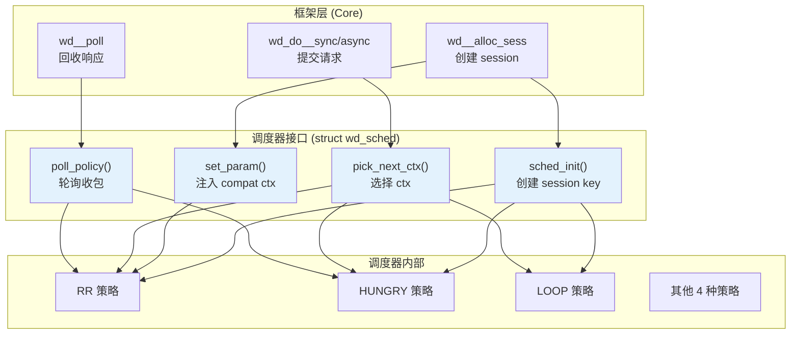

### 7.2 调度器接口

```c
struct wd_sched {
    const char *name;
    int sched_policy;

    // Session 创建时：创建 sched_key
    handle_t (*sched_init)(handle_t h_sched_ctx, void *sched_param);

    // Session 创建时：注入算法兼容参数
    void (*set_param)(handle_t h_sched_ctx, void *sched_key, void *param);

    // 每次请求提交时：选择 ctx
    __u32 (*pick_next_ctx)(handle_t h_sched_ctx, void *sched_key,
                           const int sched_mode);

    // Poll 收包时：遍历 session 的 async ctx
    int (*poll_policy)(handle_t h_sched_ctx, __u32 expect, __u32 *count);

    handle_t h_sched_ctx;  // 调度器内部上下文
};
```

四个接口在框架中的调用时机：

| 接口 | 调用时机 | 框架传入参数 |
|------|---------|-------------|
| `sched_init` | `wd_<alg>_alloc_sess()` | `setup->sched_param` |
| `set_param` | `sched_init` 之后立即调用 | `alg_name`, `ctxs` 指针 |
| `pick_next_ctx` | `wd_do_<alg>_sync/async()` | `sched_key`, `sched_mode` |
| `poll_policy` | `wd_<alg>_poll()` | `expect`, `&count` |

### 7.3 Session 创建时的完整对接

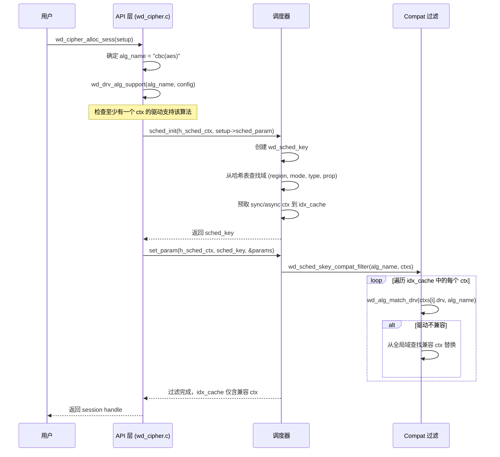

### 7.4 运行时请求分发

同步路径：

```
用户调用 wd_do_cipher_sync(sess, req)
  ├── sched.pick_next_ctx(sched_ctx, sess->sched_key, CTX_MODE_SYNC)
  │     → 返回 ctx_idx
  ├── ctx = config->ctxs[ctx_idx]        // 框架定位 ctx_internal
  ├── drv = ctx->drv                     // 框架获取驱动指针
  ├── wd_ctx_spin_lock(ctx)              // 仅 HW 类型加锁
  ├── drv->send(ctx->ctx, &msg)          // 框架调用驱动发送
  ├── drv->recv(ctx->ctx, &msg)          // 框架调用驱动回收（同步忙等）
  └── wd_ctx_spin_unlock(ctx)
```

异步路径：

```
用户调用 wd_do_cipher_async(sess, req)
  ├── sched.pick_next_ctx(sched_ctx, sess->sched_key, CTX_MODE_ASYNC)
  ├── msg = 消息池 wd_get_msg_from_pool(ctx_idx)
  ├── drv->send(ctx->ctx, msg)           // fire-and-forget
  └── 立即返回

用户线程调用 wd_cipher_poll(expect, &count)
  └── sched.poll_policy(sched_ctx, expect, &count)
        └── 遍历 session 的 async_domain idx_cache
              └── drv->recv(ctx, &msg)  // 检查完成
```

关键设计点：

1. **框架不介入选择逻辑**——`pick_next_ctx` 的实现在调度器中，框架只使用返回值
2. **框架定位 ctx**——`ctx_idx` 用于索引 `config_internal->ctxs[]`，通过 `ctxs[ctx_idx].drv` 获取驱动
3. **框架不直接操作硬件**——所有硬件访问通过 `drv->send/recv` 回调

### 7.5 对开发者的意义

- 框架与调度器的接口是固定的（4 个函数指针），新增调度策略不需要改框架代码
- `set_param` 中的 compat filter 是框架与调度器之间的关键信息传递通道——理解了 `alg_name` + `ctxs` 如何注入调度器，就理解了整个两阶段匹配的闭环
- 调度器设计细节（哈希表、Segment 链表、idx_cache、7 种策略）见独立文档 `wd_sched_design.md`

---

## 第八章：驱动模型重构

### 8.1 旧问题

旧方案的驱动层存在以下不足：

1. **无 `alloc_ctx`/`free_ctx` 回调**：ctx 分配由框架直接调用 `wd_request_ctx()` 或 `calloc()`，不经过驱动层。驱动无法控制自己 ctx 的分配逻辑。
2. **硬编码驱动名**：V1 路径 `dlopen("libhisi_sec.so")`，驱动名硬编码在 API 层代码中。
3. **`init_state` 无保护**：`driver->init()` 可能被多次调用，但部分驱动没有去重处理。
4. **`dev_cache` 初始化分散**：设备发现逻辑分散在 `wd_util.c` 和 `wd.c` 中。

### 8.2 新方案设计

驱动层新增回调族，形成完整的生命周期管理：

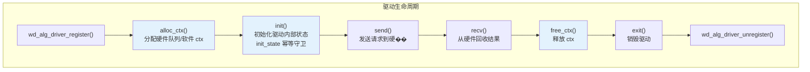

### 8.3 关键数据结构

```c
struct wd_alg_driver {
    const char  *drv_name;       // "hisi_sec2"
    const char  *alg_name;       // "cipher"
    int     priority;            // 优先级（HW > CE > SOFT）
    int     calc_type;           // UADK_ALG_HW / CE_INSTR / SVE_INSTR / SOFT
    int     queue_num;           // 硬件队列数
    int     op_type_num;         // 操作类型数
    int     priv_size;           // 驱动私有数据大小

    handle_t fallback;           // 软算回退驱动句柄
    int     init_state;          // 幂等守卫标志

    /* 生命周期回调 */
    int  (*init)(void *conf, void *priv);            // 驱动初始化
    void (*exit)(void *priv);                         // 驱动卸载
    int  (*send)(handle_t ctx, void *drv_msg);        // 发送请求
    int  (*recv)(handle_t ctx, void *drv_msg);        // 回收结果
    int  (*get_usage)(void *param);                   // 获取利用率
    int  (*get_extend_ops)(void *ops);                // 扩展操作

    /* V2 新增回调 */
    int  (*alloc_ctx)(char *alg_name, void *params, handle_t *ctx);  // 分配 ctx
    void (*free_ctx)(handle_t ctx);                                   // 释放 ctx
};
```

各回调的职责分工：

| 回调 | 调用阶段 | HW 驱动的行为 | CE/SOFT 驱动的行为 |
|------|---------|--------------|-------------------|
| `alloc_ctx` | Phase 2 | `wd_request_ctx()` 打开 `/dev/uacceX`，mmap QFR | `calloc` 分配软件上下文 |
| `init` | Phase 3 | 读 MMIO 寄存器，初始化队列，注册 fallback | 初始化算法上下文 |
| `send` | 运行时 | 写 doorbell 寄存器，提交描述符 | 执行 CE 指令/软算 |
| `recv` | 运行时 | 读完成队列 | 读取计算结果 |
| `free_ctx` | Uninit | `wd_release_ctx()` 关闭 fd | `free` 软件上下文 |
| `exit` | Uninit | 释放 MMIO 映射 | 清除算法上下文 |

### 8.4 init_state 幂等守卫

在 Phase 3 的 `wd_alg_init_driver()` 中，`init_state` 标志确保每个唯一驱动只初始化一次：

```
wd_alg_init_driver(config)
  └─ 遍历 config->ctxs[i]
      └─ wd_ctx_init_driver(config, &ctxs[i])
           ├─ drv = ctxs[i].drv
           ├─ if (drv->init_state) → return 0  // 已 init，跳过
           ├─ drv->priv = calloc(drv->priv_size)
           ├─ drv->init(config, drv->priv)
           └─ drv->init_state = 1
```

这意味着：
- 即使 100 个 ctx 都绑定同一个 hisi_sec2 驱动，`hisi_sec2->init()` 只调用一次
- `init` 的入参 `config` 包含全部 ctx 信息，驱动可以根据 `ctx_type` 过滤只处理自己的 ctx

### 8.5 HW 驱动的 fallback 机制

HW 驱动在 Phase 2.5 绑定阶段注册软算 fallback：

```
wd_ctx_bind_drivers()
  └─ 对每个 ctx:
      if (ctx_type == UADK_ALG_HW)
          if (!drv->fallback)
              drv->fallback = wd_request_drv(alg_name, ALG_DRV_SOFT)
```

当 HW 驱动 `send` 失败或硬件队列满时，驱动内部可调用 `fallback` 做软算回退。这是"混合加速"的关键机制——硬件忙时不阻塞，由软件兜底。

### 8.6 对比表

| 维度 | 旧方案 | 新方案 |
|------|--------|--------|
| ctx 分配 | 框架直接 `wd_request_ctx()` 或 `calloc()` | 驱动 `alloc_ctx()` 回调，驱动自管资源 |
| 驱动发现 | V1 硬编码 `dlopen("libhisi_sec.so")` | V2 `wd_dlopen_drv(NULL)` 从 uadk.cnf 批量加载 |
| 幂等保护 | 无，驱动自行判断 | `init_state` 标志位集中管理 |
| fallback | 无显式机制 | `drv->fallback` 句柄 + 条件检查 |
| 设备发现 | 分散在各模块 | `dev_cache` 集中管理（NUMA 感知） |

### 8.7 对开发者的意义

新增驱动时需实现完整的回调族：

- 必须实现 `alloc_ctx` 和 `free_ctx`——框架不再提供默认的 ctx 分配
- `init_state` 由框架管理，驱动不需要自己判断是否已经初始化
- HW 驱动的 `alloc_ctx` 应该调用 `wd_request_ctx()` 打开 UACCE 设备；CE/SOFT 驱动的 `alloc_ctx` 只需 `calloc` + 设置 `ctx_type`（非 0！）

**重要：ctx_type 首字段不变量**

所有上下文结构体的首字节必须是 `ctx_type`。`wd_ctx_is_hw()` 通过 `*(__u8 *)h_ctx` 判断上下文类型。由于 `UADK_CTX_HW == 0` 且 `calloc` 初始化为 0，非 HW 上下文的分配函数必须在 `calloc` 后立即显式设置非零 `ctx_type`（如 `UADK_CTX_CE_INS = 1`），否则会被误判为 HW 类型。

---

## 第九章：并发模型与生命周期管理

### 9.1 三态初始化状态机

每个算法模块维护一个全局单例配置（如 `wd_cipher_setting`），初始化状态通过原子 CAS 操作在三个状态间转换：

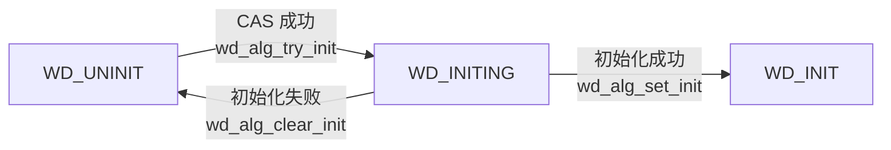

关键约束：

- 多线程同时调用 `wd_cipher_init` 时，仅一个线程通过 CAS 成功进入初始化流程，其他线程等待
- 初始化失败时状态必须重置为 `WD_UNINIT`，否则后续初始化请求将永远返回 `-WD_EBUSY`
- V1 和 V2 路径不能共存于同一进程——CAS 保证仅一条路径能成功初始化

### 9.2 全局单例约束

每个算法模块只有一个 `setting` 全局实例。该设计源于 UACCE 内核接口的进程级语义——不允许两个用户态实例独立映射同一设备队列区域。

```
否决方案：实例句柄模式（类似 OpenSSL 的 EVP_CIPHER_CTX）
否决理由：句柄模式隐含"每个实例独立配置"的假设，与 UACCE 进程级接口矛盾
代价：V1 和 V2 路径不能在同一进程中同时使用
```

### 9.3 同步路径锁策略

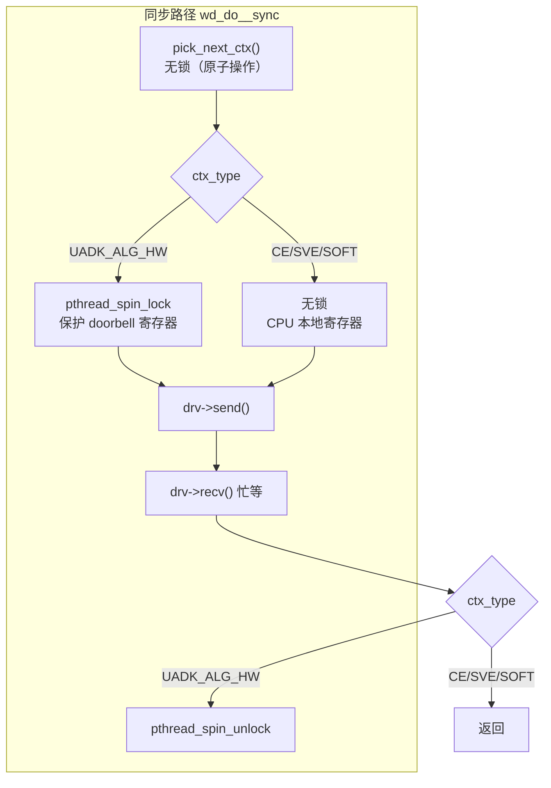

`wd_ctx_spin_lock` 仅在上下文类型为 `UADK_ALG_HW` 时执行 `pthread_spin_lock`，CE/SVE/SOFT 类型直接返回。设计依据：

- **HW 上下文**：多线程同时写硬件队列的 doorbell 寄存器（共享 MMIO 资源），需要锁保护
- **CE/SVE 指令**：操作的是 CPU 本地寄存器，每个核的执行上下文独立，加锁只会引入不必要的开销

### 9.4 异步消息池背压

异步消息池是固定大小的 ring buffer，其容量受限于硬件队列深度（通常 1024）：

```c
// wd_init_async_request_pool() 中
pool_size = min(ctx_msg_num, hardware_queue_depth);
pool = calloc(pool_size, sizeof(struct async_msg));
```

池满时 `wd_get_msg_from_pool()` 返回 `-WD_EBUSY`，作为背压信号通知调用者：

```
否决方案：动态增长的消息池
否决理由：动态增长会掩盖硬件瓶颈，调用者在背压下持续提交请求，
          最终导致 OOM 或延迟爆炸
```

`-WD_EBUSY` 路径不记录错误日志，因为该返回值在正常高负载下可能出现频繁，日志输出本身会成为性能负担。调用者应通过重试或降级机制处理。

### 9.5 内存生命周期管理

多层数据结构的释放顺序必须严格遵循 LIFO（后进先出）原则：

```mermaid
flowchart TB
    subgraph "分配顺序"
        D1["wd_alg_drv_discover<br/>分配 drv_array"]
        D2["wd_alg_ctx_init<br/>分配 ctx_config + ctxs 数组"]
        D3["wd_alg_ctx_init<br/>分配调度器"]
        D4["wd_alg_ctx_init<br/>alg_init 分配 ctx_config_internal"]
        D5["wd_ctx_bind_drivers<br/>递增 drv 引用计数"]
        D6["wd_alg_init_driver<br/>分配 driver->priv"]
    end

    subgraph "释放顺序（逆序）"
        R6["wd_alg_uninit_driver<br/>释放 driver->priv"]
        R5["wd_ctx_unbind_drivers<br/>递减 drv 引用计数"]
        R4["wd_alg_ctx_uninit<br/>释放 ctx_config_internal"]
        R3["wd_sched_rr_release<br/>释放调度器"]
        R2["释放 ctx_config + ctxs 数组"]
        R1["wd_alg_drv_undiscover<br/>释放 drv_array"]
    end

    D1 --> D2 --> D3 --> D4 --> D5 --> D6
    R6 --> R5 --> R4 --> R3 --> R2 --> R1
```

**V1 vs V2 的 uninit 差异**：

| 阶段 | V1 uninit | V2 uninit |
|------|-----------|-----------|
| `wd_alg_uninit_driver` | ✅ 释放驱动私有数据 | ✅ 释放驱动私有数据 |
| `wd_ctx_unbind_drivers` | ✅ 递减引用计数 | ✅ 递减引用计数 |
| `wd_<alg>_common_uninit` | ✅ 释放消息池 + 清除 sched | ✅ 释放消息池 + 清除 sched |
| `wd_put_drv_array` | ✅ 释放 drv_array | ❌ 不释放（attrs 管理） |
| `wd_alg_attrs_uninit` | ❌ 不调用（ctx 用户管理） | ✅ 释放 ctx_config + sched |

V1 路径的 uninit 不调用 `wd_alg_attrs_uninit()`（上下文由用户分配，框架不负责释放）。V2 路径必须调用（上下文由框架分配）。若 V2 uninit 遗漏此调用，将导致框架分配的 ctx 资源和 `drv_array` 内存泄漏。

### 9.6 对开发者的意义

- 初始化状态机的三态转换是线程安全的入口屏障——所有算法模块的 init 函数都通过 `wd_alg_try_init()` 进入
- 锁策略的 HW/非 HW 区分意味着：CE/SVE 驱动的同步操作在线程安全上不需要额外锁保护，为 CE ctx 设置 `need_lock=true` 不会产生正确性问题，但会引入不必要的性能开销
- 释放顺序不当是 double-free 的常见根因——遵循"谁分配谁释放"原则，避免交叉释放


## 第十章：扩展点与开发者指引

### 10.1 如何新增算法模块

新增算法模块应遵循 `wd_cipher.c` 的模式：

```
1. 定义算法模块的全局 setting（含 status 状态机 + config + sched）
2. 实现 open_driver 函数（V1 路径从配置加载，V2 路径从 uadk.cnf 批量加载）
3. 实现 common_init（wd_init_ctx_config + wd_init_sched + 消息池）
4. 实现 init 和 init2_ 入口函数（构造 wd_init_attrs 后调用 wd_alg_attrs_init）
5. 实现 alloc_sess 函数（wd_drv_alg_support + sched_init + set_param）
6. 实现 do_sync/async 函数（pick_next_ctx + drv->send/recv）
7. 实现 poll 函数（sched.poll_policy）
```

### 10.2 如何新增硬件驱动

新增驱动需实现 `wd_alg_driver` 的全部回调：

```c
struct wd_alg_driver my_drv = {
    .drv_name   = "my_accel",
    .alg_name   = "cipher",
    .calc_type  = UADK_ALG_HW,
    .priority   = 200,
    .queue_num  = 16,
    .op_type_num = 2,

    .alloc_ctx  = my_drv_alloc_ctx,    // → wd_request_ctx()
    .free_ctx   = my_drv_free_ctx,     // → wd_release_ctx()
    .init       = my_drv_init,         // → 初始化 MMIO + 队列
    .exit       = my_drv_exit,
    .send       = my_drv_send,
    .recv       = my_drv_recv,
    .get_usage  = NULL,                // 可选
};

// 在模块初始化时注册
wd_alg_driver_register(&my_drv);
```

在 `WD_STATIC_DRV` 模式下，需提供 `probe` 函数并在 `wd_alg.h` 中声明，通过静态构造函数自动注册。

### 10.3 如何新增调度策略

框架不直接实现调度策略，而是通过 `struct wd_sched` 接口委托给调度器。新增策略见 `wd_sched_design.md` 第十二章的指引。

### 10.4 已知限制

| 限制 | 影响 | 优先级 | 说明 |
|------|------|--------|------|
| 8 个模块未清理 `wd_ctx_drv_config()` | 冗余代码 | P0 | comp/digest/aead/rsa/dh/ecc/agg/join_gather/udma 仍调用旧函数，Phase 2.5 已做相同工作 |
| Phase 2 仍使用 `switch(task_type)` 分支 | 未完全统一 | P1 | `wd_ctxs_unified_alloc()` 待实现替换三条分支 |
| `drv_array` 所有权模糊 | 内存泄漏风险 | P1 | V1 路径中谁负责释放 drv_array？当前靠调用顺序保证 |
| 调度器无热插拔支持 | 可靠性 | P2 | 设备移除后 poll 已释放的 ctx → 崩溃 |
| 调度器无运行时统计 | 可观测性 | P2 | 无法区分锁竞争/负载不均/设备瓶颈 |
| `dev_cache` 不支持热插拔 | 可用性 | P2 | 首次 ctx 分配后缓存永不刷新 |
| 活跃队列跟踪 | 性能 | P2 | Poll 仍可能扫描无未完成请求的 ctx |
| V2 初始化重试无超时 | 可靠性 | P3 | `while(ret != 0)` 无限循环，无退避 |
| 8 个模块未集成 init2 的统一 alloc_sess | 功能完整 | P1 | 部分模块的 alloc_sess 未调用 `wd_get_compat_ctxs()` |

### 10.5 问题定位思路

| 现象 | 可能原因 | 检查点 |
|------|---------|--------|
| init 返回 -WD_ENODEV | Phase 1 无匹配驱动 | `uadk.cnf` 是否配置？`/sys/class/uacce/` 下是否有设备？ |
| init 返回 -WD_EAGAIN | Phase 2 资源不足 | ctx 数量是否超过硬件队列深度？ |
| session 创建返回 0 | 无兼容 ctx | `wd_drv_alg_support()` 是否遍历了全部 ctx？`wd_alg_match_drv` 是否匹配？ |
| 同步请求返回 -WD_EBUSY | 消息池满 | `ctx_msg_num` 是否过小？硬件处理是否滞后？ |
| 异步 poll 收不到响应 | poll 策略不对 | `poll_policy` 是否遍历了 session 的 async ctx？ |
| uninit 时崩溃 | 双重释放/释放顺序错误 | V2 路径是否调用了 `wd_alg_attrs_uninit`？V1 是否误调了？ |

### 10.6 ctx_type 首字段不变量（重要）

所有驱动程序分配的 ctx 结构体首字节必须是 `ctx_type`。

```c
// HW ctx — 没问题，UADK_CTX_HW == 0，calloc 初始化为 0 即为 HW
struct hw_ctx {
    __u8 ctx_type;   // 0 = UADK_CTX_HW，calloc 后自动为 0
    ...
};

// CE ctx — 必须在 calloc 后显式设置！
struct ce_ctx {
    __u8 ctx_type;   // 必须手动设为 UADK_CTX_CE_INS (1)
    ...
};

// 错误示例
struct ce_ctx *ctx = calloc(1, sizeof(*ctx));
// ctx->ctx_type 是 0 = UADK_CTX_HW → 框架误判为 HW 类型！
// 正确做法:
ctx->ctx_type = UADK_CTX_CE_INS;
```

`wd_ctx_is_hw()` 通过 `*(__u8 *)h_ctx` 判断：值为 0 就是 HW，非 0 就是非 HW。因此非 HW 驱动必须在 `calloc` 后立即设置 `ctx_type`。

---

## 附录：关键函数映射表

| 函数 | 所属章节 | 功能简述 |
|------|---------|---------|
| `wd_alg_attrs_init` | 4/5 | V2 路径 Phase 1+2 封装入口，编排驱动发现和 ctx 分配 |
| `wd_alg_attrs_uninit` | 9 | 逆序释放所有初始���资源 |
| `wd_alg_drv_discover` | 5.3 | Phase 1：驱动发现 |
| `wd_get_drv_array` | 5.3 | 扫描驱动注册链表，按条件过滤 |
| `wd_alg_ctx_init` | 5.4 | Phase 2：ctx 分配 + 调度器创建 |
| `wd_ctx_bind_drivers` | 5.5 | Phase 2.5：RR 驱动绑定 |
| `wd_alg_init_driver` | 5.6 | Phase 3：驱动初始化（init_state 幂等） |
| `wd_ctx_init_driver` | 5.6 | 单个 ctx 的驱动初始化 |
| `wd_drv_alg_support` | 6.3 | 检查 config 中是否有 ctx 支持目标算法 |
| `wd_get_compat_ctxs` | 6 | 遍历 ctx 数组，返回兼容索引集合 |
| `wd_sched_set_param` | 7.3 | 向调度器注入 compat 过滤参数 |
| `wd_init_ctx_config` | 4 | 将 wd_ctx 数组深拷贝到 wd_ctx_internal |
| `wd_init_sched` | 4 | 拷贝调度器函数指针 |
| `wd_alg_try_init` | 9.1 | CAS 状态机：UNINIT → INITING |
| `wd_alg_set_init` | 9.1 | CAS 状态机：INITING → INIT |
| `wd_alg_clear_init` | 9.1 | CAS 状态机：INITING → UNINIT（失败回滚） |
| `wd_alg_driver_register` | 8 | 驱动注册到全局链表 |
| `wd_request_drv` | 8 | 从全局链表申请驱动 |
| `wd_ctx_spin_lock` | 9.3 | 条件加锁（仅 HW 类型） |
| `wd_init_async_request_pool` | 9.4 | 创建异步消息池（固定大小 ring buffer） |
