# UADK 调度器设计文档 — 从旧问题到新方案

> **版本**: 1.0
> **日期**: 2026-05-10
> **读者**: UADK 框架开发与性能优化人员
> **阅读方式**: 请按顺序阅读。本文档以"老问题 → 新方案"对比为主线，帮助读者理解调度器的演进动机与实现原理。

---

## 第一章：调度器要解决什么问题

### 1.1 调度器的角色

UADK 是一个异构加速框架，管理着多种类型的加速资源：硬件加速器（SEC/HPRE/ZIP）、CPU 密码指令扩展（CE/SVE）和 CPU 软算回退。当用户提交一个加密/压缩请求时，调度器的职责就是回答一个简单的问题：

> **这个请求应该交给哪个上下文（ctx）去执行？**

### 1.2 调度器在初始化流水线中的位置

在 UADK V2 的初始化流程中，调度器的创建位于 4 阶段流水线的末端：

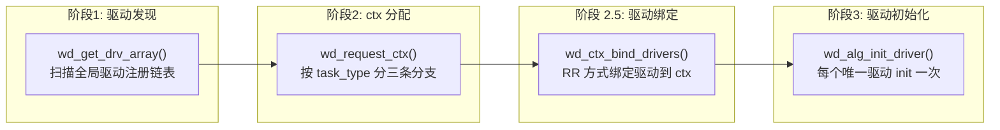

调度器由 `wd_sched_rr_alloc()` 在阶段 2 创建，在阶段 2.5 通过 `wd_sched_rr_instance()` 注入 ctx 信息。它的生命周期贯穿整个框架——从 session 创建到每个请求的分发。

### 1.3 调度器的三个核心时刻

| 时刻 | 触发点 | 调度器做的事 |
|------|--------|-------------|
| **Session 创建** | `wd_cipher_alloc_sess()` | 预取当前 session 可用的 sync/async ctx |
| **请求提交** | `wd_do_cipher_sync/async()` | 调用 `pick_next_ctx` 选择一个 ctx |
| **响应回收** | `wd_cipher_poll()` | 调用 `poll_policy` 遍历活跃 ctx 收包 |

### 1.4 旧方案 vs 新方案一句话

- **旧方案**（V1/v2.10 前）：三维固定数组 `[region][mode][type]` + session 预绑定 ctx ID
- **新方案**（当前）：动态哈希表 4 维 key + segment 链表 + session 级 idx_cache 负载感知

---

## 第二章：旧方案的问题

旧调度器方案的设计源于 hisi_sec2 单设备场景，在扩展到多设备、多 NUMA、多类型的异构环境后暴露了 11 个核心问题（P11-P21），可归纳为四个维度。

### 2.1 问题全景

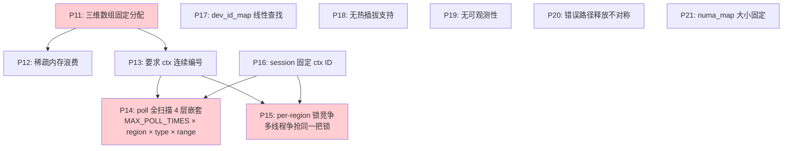

### 2.2 内存与可扩展问题（P11、P12、P21）

**核心矛盾**：调度器的容量在初始化时锁定，无法动态适配硬件拓扑变化。

旧方案使用 `[region_num][SCHED_MODE_BUTT][type_num]` 三维数组，在 `wd_sched_rr_alloc()` 中一次性分配完毕：

```
sched_ctx = calloc(sizeof + sizeof(sched_info) × region_num)
→ 每个 region 再分配: ctx_region[mode] = calloc(type_num × sizeof(struct sched_ctx_region))
```

典型配置下（8 NUMA × 2 mode × 10 type），`8 × 2 × 10 = 160` 个槽位被全部分配，但实际使用的可能不到 10%。NUMA 映射表 `numa_map[NUMA_NUM_NODES]` 同样固定大小，无法适应运行时 NUMA 拓扑变化。

**数量级**：128 NUMA × 10 type 时，约 368KB 内存分配，有效使用率 < 10%。

### 2.3 ctx 管理问题（P13、P16）

**P13 — 连续 ctx 假设**：`wd_sched_rr_instance()` 通过 `(begin, end)` 定义连续的 ctx 范围。调度器假设范围内的所有 ctx 都有效且属于同一调度域。但在多进程共享设备、ctx 动态分配释放的场景下，ctx ID 是碎片化的：

```
ctx 池 [0..99]，进程 A 分配到 ctx = {5, 17, 33, 42, 78, 91}
旧方案: begin=5, end=91  → 轮询时遍历 87 个位置，仅 6 个有效
无效 poll 调用比有效多 10-100 倍
```

**P16 — session 固定 ctx**：`session_sched_init()` 在 session 创建时一次性分配好 `sync_ctxid` 和 `async_ctxid`，之后该 session 的所有操作都固定使用这两个 ctx ID：

```
session_A: sync=3, async=7   → 永远用 ctx[3] 和 ctx[7]
即使 ctx[3] 过载、ctx[5] 空闲，也无法调整
与 RR 语义矛盾：session 级固定 ctx 退化为"每个 session 独占一个 ctx"
```

### 2.4 性能问题（P14、P15、P17）

**P14 — poll 全扫描**：这是最严重的性能问题。响应回收使用 4 层嵌套循环：

```
最外层: while (++loop_time < MAX_POLL_TIMES)        // 最多 1000 次
  ├─ 中层: for (i = 0; i < region_num; i++)          // 8 个 NUMA
  │   ├─ 内层: for (j = 0; j < type_num; j++)        // 10 种类型
  │   │   └─ 最内层: for (pos = begin; pos <= end; pos++)  // ctx 范围
```

最坏迭代次数：**1000 × 8 × 10 × 20 = 1,600,000 次 poll_func 调用**。

**P15 — 锁竞争**：per-region 互斥锁保护 ctx 分配状态。8 线程同时发送时，7/8 的时间花在锁等待上。

**P17 — 线性查找**：DEV 模式下 `dev_id_map` 使用线性遍历查找设备 ID → region ID 映射，每次操作 O(n)。

### 2.5 运维问题（P18、P19）

- **无热插拔**：调度器状态在 `wd_sched_rr_alloc()` 后永不更新。设备移除后 poll 已释放的 ctx → 崩溃。
- **无可观测性**：没有任何运行时计数器或统计接口。性能劣化时无法区分是锁竞争、负载不均还是设备瓶颈。

### 2.6 对开发者的意义

老问题的本质是**设计假设的过时**——单设备、连续 ctx、固定拓扑的假设在多设备异构场景下全部失效。理解这些问题是理解新方案设计取舍的关键。如果遇到性能劣化，首先检查是否属于 P14（全扫描 poll）或 P15（锁竞争）的症状：CPU 利用率高但吞吐量低。

---

## 第三章：新方案的设计思路

### 3.1 问题驱动的方案矩阵

| 老问题 | 新方案核心设计 | 解决原理 |
|--------|--------------|---------|
| P11/P12 固定数组/内存浪费 | 全局哈希表 | 按 key 按需创建域，零浪费 |
| P13 连续 ctx 要求 | Segment 链表 | 不连续 range 用链表串联 |
| P14 poll 全扫描 | Session 双域 + idx_cache | 只 poll session 用过的 ctx |
| P15 锁竞争 | 原子操作 + 锁层级拆分 | 热路径无锁，冷路径分粒度 |
| P16 固定 ctx | idx_cache 运行时 pick | 每次 pick 动态选择 |
| P17 线性查找 | 哈希表统一方式 | DEV 模式也走哈希表 |
| P18 无热插拔 | 独立管理 | 释放时遍历全部 skey |

### 3.2 新方案的三根支柱

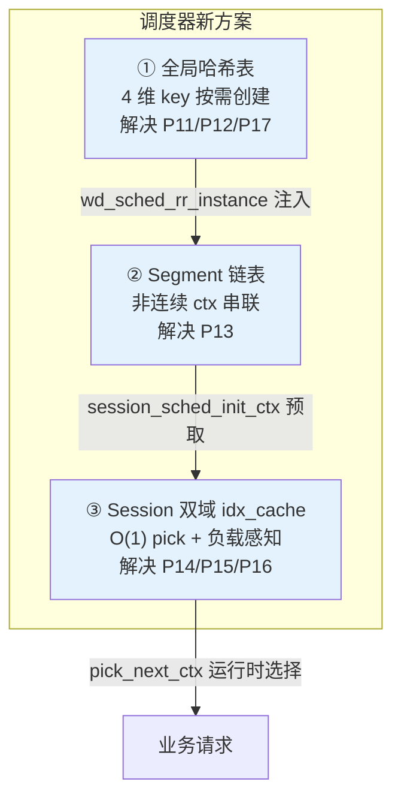

三个设计层层递进：哈希表管理全局域 → segment 管理离散 ctx → idx_cache 管理 session 级选择。

### 3.3 设计目标

1. **内存高效**：仅分配使用的域，按需创建
2. **非连续兼容**：ctx ID 可以任意分布
3. **O(1) 热路径**：pick 和 poll 不随系统规模线性增长
4. **负载感知**：session 级动态选择最空闲的 ctx
5. **可扩展**：新维度（设备类型、优先级等）只需修改哈希函数

### 3.4 对开发者的意义

新方案不是一个孤立的优化，而是对旧方案所有已知问题的系统性回复。在阅读后续章节时，可以对照这个矩阵来理解每个设计决策的动机。

---

## 第四章：全局哈希表

### 4.1 旧方案的问题

三维数组 `[region_num][2][type_num]`：
- 分配时全量分配，无论域是否使用
- 添加新维度（如 device type: HW/CE/SOFT）需要改为 4 维数组
- 数组大小在编译/初始化时锁定

### 4.2 新方案设计

用动态哈希表替代三维数组，key 为 4 维组合 `(region_id, mode, op_type, prop)`。

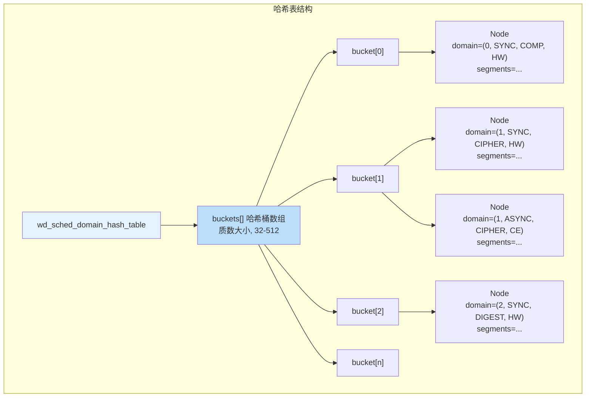

关键数据结构：

```c
/* 哈希表：管理所有调度域 */
struct wd_sched_domain_hash_table {
    struct wd_sched_domain_hash_node **buckets;  /* 哈希桶数组 */
    __u32 bucket_size;          /* 桶数量（质数） */
    __u32 entry_count;          /* 已注册域数 */
    pthread_mutex_t lock;       /* 互斥锁保护 */
};

/* 哈希节点：开链法冲突链 */
struct wd_sched_domain_hash_node {
    struct wd_sched_ctx_domain domain;   /* 调度域 */
    struct wd_sched_domain_hash_node *next;  /* 链表指针 */
};

/* 调度域：4 维 key 对应的 ctx 集合 */
struct wd_sched_ctx_domain {
    int region_id;       /* NUMA 节点或设备 ID */
    __u8 mode;           /* SYNC/ASYNC */
    __u32 op_type;       /* 操作类型 */
    __u8 prop;           /* 属性: HW/CE/SVE/SOFT */
    
    struct wd_sched_ctx_segment *segments;  /* ctx 范围链表 */
    __u32 total_ctx_count;          /* ctx 总数 */
    struct wd_sched_ctx_segment *current_segment;  /* RR 轮转指针 */
    __u32 current_pos;
    bool valid;
    pthread_mutex_t lock;
};
```

### 4.3 哈希函数

```c
/* 4 维 key 组合哈希，各维使用不同质数权重 */
hash = region_id × 73 + mode × 13 + op_type × 7 + prop × 11
return hash % bucket_size;
```

选择质数乘数的目的：降低各维度的相关性（例如 mode 只有 0/1，乘以大质数避免信息损失）。

### 4.4 桶大小策略

```
estimated_entries = region_num × 2 × type_num × UADK_ALG_TYPE_MAX
target = estimated_entries × 4/3    ← 负载因子 0.75
clamp(target, 32, 512)              ← 上下界保护
bucket_size = next_prime(target)    ← 质数桶大小
```

质数桶大小有助于哈希函数的均匀分布。最大 512 桶、最小 32 桶。

### 4.5 Double-Check 插入

当新域注册时（`wd_sched_rr_instance` 调用），插入操作采用 double-check 模式：

1. 先无锁查找一次（`wd_sched_hash_table_lookup`）
2. 若不存在，加写锁再次查找（防止并发重复创建）
3. 确认不存在后创建新节点插入链表头部

### 4.6 旧新方案对比

| 维度 | 旧方案三维数组 | 新方案哈希表 |
|------|-------------|------------|
| 内存分配 | 全量分配 160+ 槽 | 按需创建，仅实际使用的域 |
| 查找方式 | `array[region][mode][type]` O(1) 但有空洞 | `hash(key)` O(1) 平均，无空洞 |
| 添加维度 | 改结构体 + 改初始化 | 改哈希函数 + 改 key_match |
| 容量弹性 | 固定，不可变 | 固定但只需满足最大有效域数（通常 < 20） |

### 4.7 为什么选择 mutex 而非 rwlock

旧设计文档中曾提议使用 pthread_rwlock，最终实现选择了 pthread_mutex_t。原因：

- 哈希表的写操作（`wd_sched_rr_instance` 注册新域）仅在初始化阶段发生
- 读操作（`wd_sched_hash_table_lookup`）在 session 创建时发生，频率远低于请求提交
- rwlock 在写者存在时会导致读者饥饿，实现复杂度高于收益

### 4.8 对开发者的意义

哈希表的设计使得调度器可以轻松支持新的 key 维度。例如未来需要新增"优先级"维度，只需：
1. 在 `wd_sched_ctx_domain` 中新增 `priority` 字段
2. 在哈希函数中增加 `+ priority × 17`
3. 在 `wd_sched_domain_key_match` 中增加优先级比较

不需要改动任何调度策略代码。

---

## 第五章：Segment 链表

### 5.1 旧方案的问题

`wd_sched_rr_instance(begin, end)` 要求传入连续的 ctx 范围：
```
begin=5, end=91  → 调度器认为 [5, 91] 全部有效
但实际只有 {5, 17, 33, 42, 78, 91} 是分配的
```

这种假设在多进程共享设备、ctx 动态分配释放的场景下完全不可行。

### 5.2 新方案设计

用 segment 链表存储非连续的 ctx 范围。每个 segment 记录一个连续子范围 `[begin, end]`，多个 segment 串联表示完整的 ctx 集合。

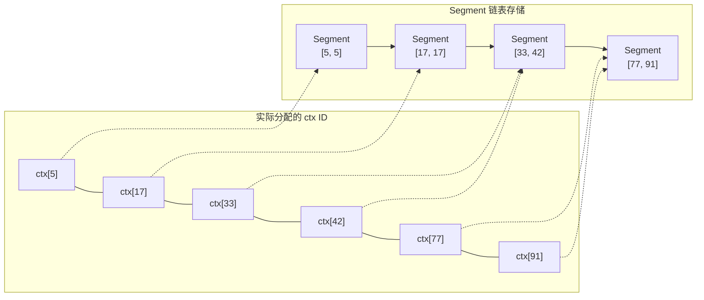

关键数据结构：

```c
/* 每个 segment 表示一个连续 ctx 子范围 */
struct wd_sched_ctx_segment {
    __u32 begin;                      /* 起始 ctx ID */
    __u32 end;                        /* 结束 ctx ID（包含） */
    struct wd_sched_ctx_segment *next; /* 下一段 */
};
```

### 5.3 O(1) RR 轮转

`wd_sched_domain_get_next_rr()` 使用 `current_segment` 指针和 `current_pos` 位置进行 O(1) 轮转：

1. 每次调用返回 `current_pos` 指向的 ctx
2. `current_pos` 在 segment 范围内递增
3. 超出当前 segment 范围时，前进到下一 segment
4. 到达链表尾部时，回绕到链表头

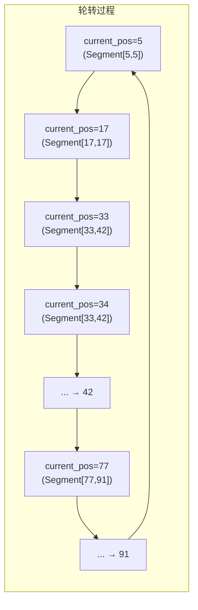

### 5.4 旧新方案对比

| 维度 | 旧方案 begin/end | 新方案 segment 链表 |
|------|-----------------|-------------------|
| 连续要求 | 必须连续 | 任意分布 |
| 无效 poll | 大量（10-100x） | 零 |
| 内存 | 大范围连续（含空洞） | 精确存储 |
| RR 复杂度 | O(1) | O(1) |

### 5.5 对开发者的意义

如果遇到 ctx 分配碎片化导致的性能问题（大量无效 poll 返回 `-EAGAIN`），升级到新方案后会自动解决。Segment 链表将 poll 范围缩小到实际分配的 ctx 集合，无效 poll 降为零。

---

## 第六章：Session Key 运行时调度

### 6.1 旧方案的问题

旧方案中 session 在创建时固定了两个 ctx ID，后续所有请求都走固定 ctx：
- 无法负载均衡：繁忙的 ctx 永远繁忙、空闲的 ctx 永远空闲
- poll 全扫描：回收响应时扫描所有 region × type × range
- 锁竞争：per-region mutex 成为多线程瓶颈

### 6.2 新方案设计

每个 session 持有 `struct wd_sched_key`，内部包含两个域：`sync_domain` 和 `async_domain`。每个域的核心是一个 idx_cache：

```c
/* Session 调度 key */
struct wd_sched_key {
    int region_id;           /* NUMA 节点 */
    __u8 type;               /* 操作类型 */
    __u8 ctx_prop;           /* 属性: HW/CE/SOFT */
    
    struct wd_sched_key_domain sync_domain;   /* 同步域 */
    struct wd_sched_key_domain async_domain;  /* 异步域 */
    
    /* Compat 过滤参数 */
    const char *alg_name;
    struct wd_ctx_internal *ctxs;
};

/* Session 域 */
struct wd_sched_key_domain {
    struct wd_sched_domain_idx_cache idx_cache;  /* ctx 选择缓存 */
    __u32 expanded_count;       /* HUNGRY 模式扩展次数 */
};

/* idx_cache: O(1) ctx 选择的核心 */
struct wd_sched_domain_idx_cache {
    __u32 idx_list[16];                    /* ctx 索引数组 */
    atomic_uint load_values[16];           /* 原子负载计数器 */
    __u32 valid_count;                     /* 有效 ctx 数 */
    
    atomic_uint rr_ptr;                    /* RR 轮转指针 */
    atomic_uint min_load_idx;              /* 缓存的最小负载索引 */
    atomic_uint op_counter;                /* 操作计数器 */
    
    __u8 policy;                           /* 调度策略 */
};
```

### 6.3 运行时选择算法

idx_cache 支持两种选择路径：

**RR 路径**（默认，适用 RR/LOOP/INSTR 等策略）：
```
selected = atomic_fetch_add(&rr_ptr, 1) % valid_count
return idx_list[selected]
```
一条原子指令完成选择，无锁，O(1)。

**负载均衡路径**（HUNGRY 策略）：
```
每次 pick:
  更新 op_counter
  每 128 次操作触发一次 min_load 缓存刷新
  return idx_list[min_load_idx]

周期更新:
  遍历 load_values[0..valid_count]
  找到 load 最小的索引 → 更新 min_load_idx
```
兼顾精度和性能：128 次操作只扫描一次，摊销后接近 O(1)。

### 6.4 请求生命周期

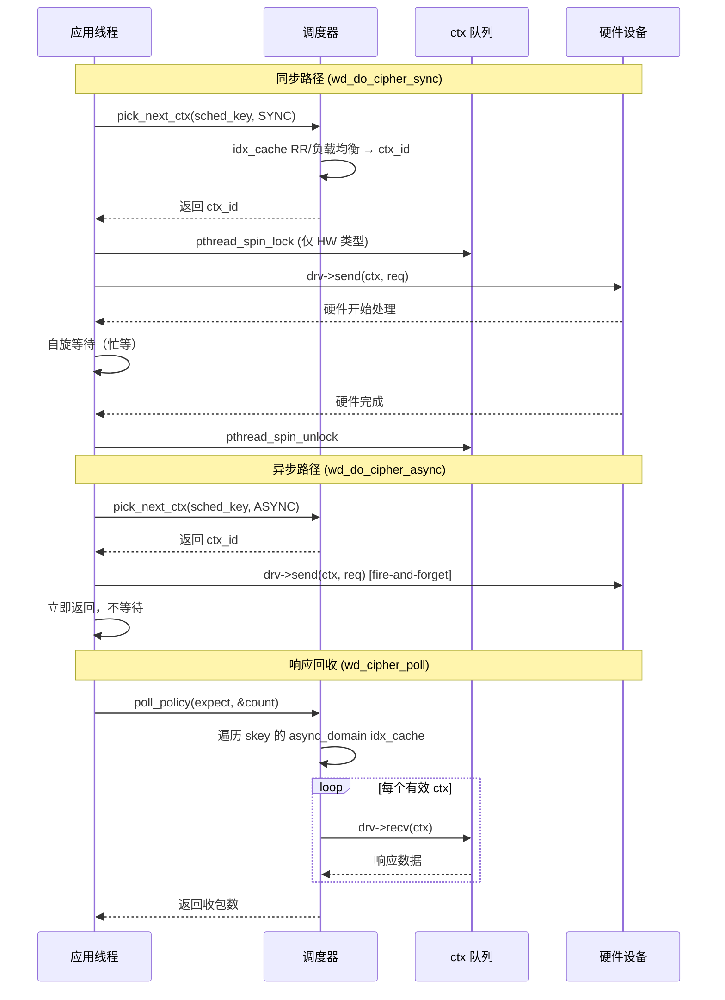

### 6.5 与旧方案 poll 对比

| 维度 | 旧方案 | 新方案 |
|------|--------|--------|
| poll 范围 | 全部 region × type × range | 仅 session 用过的 ctx |
| 嵌套层数 | 4 层（含 MAX_POLL_TIMES 循环） | 1 层遍历 idx_cache |
| 无效调用 | 大部分（空洞区间） | 零 |
| 扩展性 | O(region × type × range) | O(valid_count) |
| 锁 | per-region mutex（发送和 poll 争抢） | 原子操作（无锁热路径） |

### 6.6 对开发者的意义

Session key 和 idx_cache 是理解新方案性能优势的关键：
- 如果业务使用 RR 策略，每次 pick 仅一条原子指令，性能损耗可忽略
- 如果业务需要负载感知（如长连接场景），选择 HUNGRY 策略
- idx_cache 的 `valid_count` 反映 session 实际可用的 ctx 数量，过小说明 ctx 分配不足，过大说明兼容过滤后仍有冗余

---

## 第七章：7 种调度策略

### 7.1 策略模式架构

调度器采用策略模式：`sched_table[]` 是一个函数指针数组，每种策略实现 4 个操作：

```c
struct wd_sched {
    const char *name;
    handle_t (*sched_init)(handle_t h_sched_ctx, void *sched_param);
    __u32 (*pick_next_ctx)(handle_t h_sched_ctx, void *sched_key, const int sched_mode);
    int (*poll_policy)(handle_t h_sched_ctx, __u32 expect, __u32 *count);
    handle_t h_sched_ctx;  /* 调度器内部上下文 */
};
```

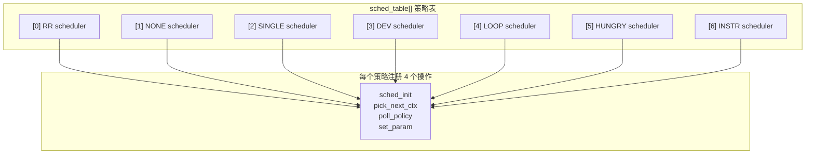

### 7.2 策略对比表

| 策略 | sched_init（预取） | pick_next_ctx（选择） | poll_policy（收包） | 适用场景 |
|------|------------------|---------------------|--------------------|---------|
| **RR** | 1 sync + 1 async ctx | idx_cache RR 轮转 | 遍历所有 skey 的 async 域 | 通用多 ctx 默认选择 |
| **NONE** | 空操作 | 固定返回 0 | 直接 poll ctx[0]（含 MAX_POLL_TIMES 重试） | 单 ctx，无需调度 |
| **SINGLE** | 空操作 | sync=0, async=1 | 直接 poll ctx[1] | 固定双 ctx 业务 |
| **DEV** | 同 RR + dev_id | 同 idx_cache RR | 同 RR | No-SVA 模式设备寻址 |
| **LOOP** | 遍历所有 4 种 prop 类型各取 1 sync+1 async | 同 RR | 同 RR | HW/CE/SOFT 全覆盖 |
| **HUNGRY** | 遍历所有 4 种 prop 类型各取 1 sync+1 async | 负载均衡 + 负载 > 256 时动态扩展新 ctx | 单一 skey + 负载追踪 | 高负载动态扩展 |
| **INSTR** | 1 sync + 1 async ctx | 同 RR | 仅 `idx_list[0]` 单队列 poll | 纯指令加速 |

### 7.3 策略选择建议

- **大多数场景**：使用 RR，它在通用性和性能之间取得了最好平衡
- **高吞吐异步场景**：使用 HUNGRY，它能在负载升高时动态增加 ctx 数量
- **纯 CPU 指令场景**：使用 INSTR，避免不必要的硬件适配开销
- **单队列场景**：使用 NONE 或 SINGLE，跳过哈希表创建省内存

### 7.4 策略劫持说明

注意：`wd_sched.h` 中公开的枚举只定义了 4 种（RR/NONE/SINGLE/DEV，`SCHED_POLICY_BUTT=4`），但 `wd_sched.c` 实际实现了 7 种。LOOP(4)、HUNGRY(5)、INSTR(6) 通过"劫持"数组越界的方式实现——`sched_table` 数组大小被声明为 `SCHED_POLICY_BUTT`(4) 但实际初始化了 7 个条目。C 编译器的灵活数组初始化允许这种用法，但 `sched_table[4]` 和 `sched_table[5]` 等访问在形式上是越界的。这是当前实现的一个已知 hack，修改 `SCHED_POLICY_BUTT` 值会导致这些策略不可用。

### 7.5 对开发者的意义

如果需要在现有策略基础上做定制，优先考虑修改 `pick_next_ctx` 的行为而非从头实现新策略。例如，如果想实现"优先选择某个 prop 类型的 ctx"，只需要修改 RR 策略的 pick 函数，不需要动 init 和 poll。

---

## 第八章：两阶段算法兼容过滤

### 8.1 问题场景

`wd_sched_rr_alloc()` 分配 ctx 时只知道算法类型（cipher/digest），不知道 session 的具体算法（cbc(aes)/ecb(sm4)）。预取的 ctx 可能绑定到不支持目标算法的驱动。

### 8.2 两阶段方案

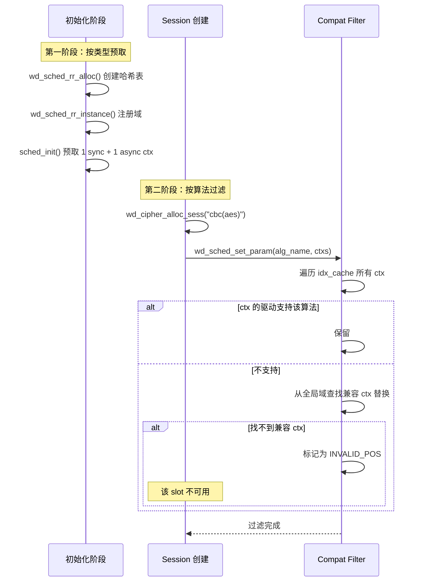

第一阶段（init 时）：按 `(region_id, mode, op_type, prop)` 从哈希表找到域，预取 RR 轮转到的 ctx。

第二阶段（session 创建时）：`wd_sched_set_param()` 被调用，传入 `alg_name` 和 `ctxs` 指针，触发 `wd_sched_skey_compat_filter()`：
- 遍历 idx_cache 中每个 ctx 的驱动
- 调用 `wd_alg_match_drv(drv, alg_name)` 检查兼容性
- 不兼容的 ctx 被替换为全局域中的兼容 ctx
- 找不到兼容 ctx 时标记为 `INVALID_POS`

### 8.3 为什么不在 init 时直接分配兼容 ctx

核心原因：**信息差**。

```
init 时知道:     算法类型 = cipher
session 时知道:  具体算法 = cbc(aes)
```

如果在 init 时就精确匹配算法，需要在 init 参数中预知所有将来会创建的 session 算法——这违背了"用户只需描述需求"的设计目标。

### 8.4 代价

两阶段方案不是零成本的：
- 预取的 ctx 可能被 compat filter 立即替换，产生一次浪费
- `wd_alg_match_drv` 需要遍历全局驱动注册链表
- 但 session 通常是长生命周期的，创建成本被后续千万次请求摊薄

### 8.5 对开发者的意义

如果在 session 创建时遇到 `no compatible ctx found` 错误：
1. 检查 init 时是否分配了至少一个绑定到支持该算法的驱动的 ctx
2. 检查 ctx_prop 参数是否正确（HW ctx 不能用于 CE 算法）
3. 考虑增加 init 时的 ctx 总数，增加兼容 ctx 的命中概率

---

## 第九章：业务运行时请求调度流程

### 9.1 同步路径完整链路

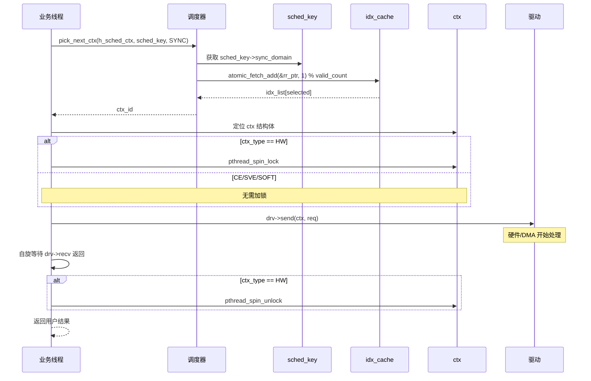

### 9.2 异步路径完整链路

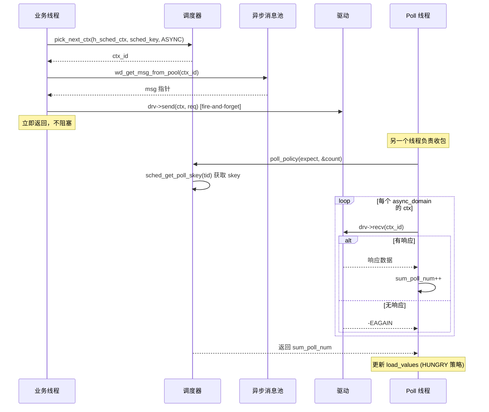

### 9.3 多线程并发调度

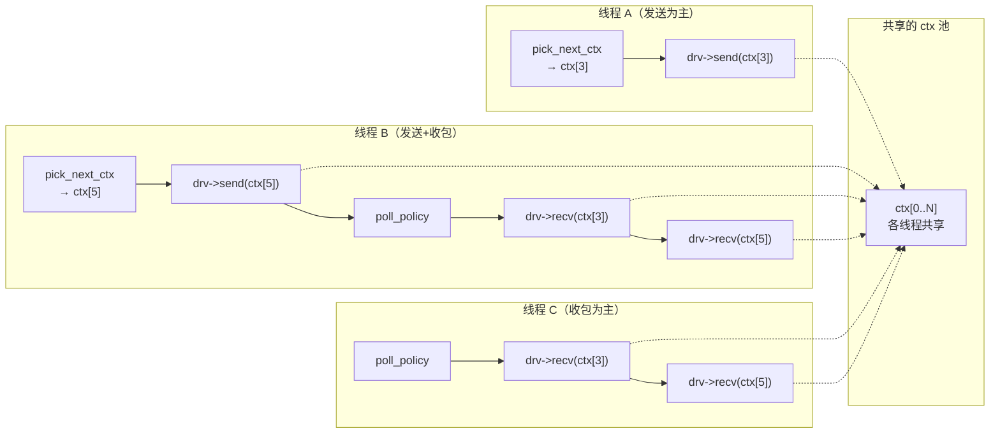

关键的设计点：

1. **pick_next_ctx 无锁**：idx_cache 的 RR 指针是原子操作，多线程同时 pick 不会冲突
2. **所有线程共享 ctx 池**：一个 ctx 可以被多个 session、多个线程使用
3. **多个线程可以同时 poll**：每个 poll 线程通过 `tid % skey_num` 选择不同的初始 skey 遍历，避免全部从 0 开始
4. **spin_lock 仅对 HW 类型生效**：CE/SVE/SOFT 路径完全无锁

### 9.4 poll 线程分配机制

当多个线程同时调用 `wd_cipher_poll()` 时，每个线程通过 `sched_get_poll_skey()` 分配自己的 skey：

1. 以 `tid % skey_num` 为起始偏移随机化
2. 从起始位置开始，找到一个未被其他线程占用的 skey slot
3. 使用 `skey_lock` 做 double-check 避免竞争
4. 分配后线程轮询该 skey 的所有 async ctx

这意味着 N 个线程会 poll N 个 skey，但存在多个线程 poll 同一个 skey 的可能（如果线程数 > skey 数）。

### 9.5 对开发者的意义

理解运行时调度流程有助于性能分析：
- **发送吞吐上不去**：检查 pick_next_ctx 是否成为瓶颈（可能是 idx_cache 中 valid_count = 0）
- **响应收不回来**：检查 poll 线程数和 skey 数的比例，确保足够多的线程参与 poll
- **单线程场景**：使用同步路径，避免异步路径的消息池和 poll 线程额外开销

---

## 第十章：并发模型

### 10.1 锁层级结构

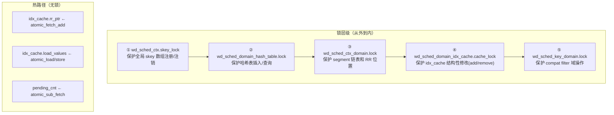

### 10.2 各锁的获取场景

| 锁 | 获取场景 | 频率 | 持有时间 |
|----|---------|------|---------|
| skey_lock | skey 注册/注销 | 低（session 创建/销毁） | 微秒级 |
| hash_table.lock | 哈希表操作 | 低（init/instance） | 微秒级 |
| domain.lock | segment 修改、RR 轮转 | 中（每次 pick） | 纳秒级 |
| cache_lock | idx_cache 结构性修改 | 低（HUNGRY 扩展时） | 微秒级 |
| key_domain.lock | compat filter | 低（session 创建时） | 毫秒级（含驱动查询） |

### 10.3 热路径无锁设计

idx_cache 的核心操作全部使用原子指令，不加 mutex：

```
pick_next_ctx (RR):
  selected = atomic_fetch_add(&rr_ptr, 1) % valid_count
  return idx_list[selected]
  → 一条 XADD 指令，无需任何锁

update_load:
  atomic_fetch_add(&load_values[idx], delta)
  → 一条原子加法，无需锁
```

spin_lock 仅在 HW 类型的 ctx 上使用，用于保护对硬件 doorbell 寄存器（共享 MMIO 资源）的写入。CE/SVE/SOFT 类型的 ctx 完全无锁——因为 CPU 指令操作的是核内寄存器，线程间天然隔离。

### 10.4 并发安全保证

- **哈希表**：`wd_sched_hash_table_lookup` 和 `wd_sched_hash_table_insert` 使用 mutex 保护，double-check 防止重复创建
- **segment 链表**：`wd_sched_domain_add_segment` 使用 domain lock 保护 append 操作
- **idx_cache**：结构性修改（add/remove ctx）使用 cache_lock 保护；热路径操作（pick/update）使用原子操作
- **skey 注册**：`sched_skey_param_init` 和 `sched_get_poll_skey` 使用 skey_lock + double-check

### 10.5 对开发者的意义

新方案的并发模型可以概括为"一把锁都不多拿"：
- 能走原子操作的绝不用锁
- 能在冷路径加锁的绝不影响热路径
- 能缩小锁粒度的绝不扩大

如果遇到并发性能问题，检查是否有代码路径在热路径上获取了非预期的锁——例如在回调函数或钩子中拿了 mutex。

---

## 第十一章：生命周期管理

### 11.1 完整生命周期

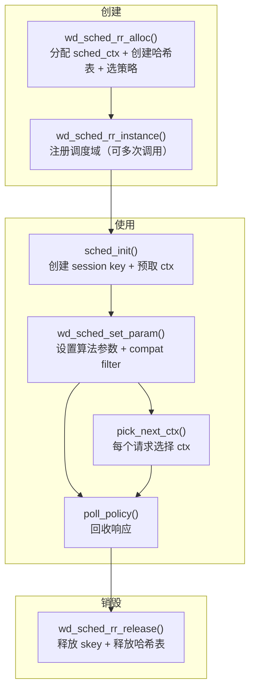

### 11.2 各阶段说明

**创建阶段**：
- `wd_sched_rr_alloc(sched_type, type_num, region_num, poll_func)`：分配 `wd_sched_ctx`，根据策略类型决定是否创建哈希表（NONE/SINGLE 跳过），从 `sched_table[]` 复制函数指针
- `wd_sched_rr_instance(sched, param)`：向哈希表插入 4 维 key 对应的域，添加 segment。可被多次调用注册多个域

**使用阶段**：
- `sched_init()`：分配 `wd_sched_key`，调用 `session_sched_domain_init` 预取 sync/async ctx，初始化 idx_cache
- `wd_sched_set_param()`：传入 `alg_name` 和 `ctxs`，触发 compat filter 替换不兼容 ctx
- `pick_next_ctx()`：每次请求调用，走 idx_cache 选择
- `poll_policy()`：回收响应，遍历 skey 的 async 域

**销毁阶段**：
- `wd_sched_rr_release()`：遍历所有 skey 释放 idx_cache，销毁哈希表（释放所有 segment 链表和 domain 锁），释放 `sched_ctx` 和 `sched`

### 11.3 对开发者的意义

生命周期管理中最重要的是释放顺序：必须先释放所有 skey（依赖哈希表和 ctx），再释放哈希表（包含所有 segment）。如果引入新的调度器内部数据结构，务必在 `wd_sched_rr_release` 中按依赖顺序释放。

---

## 第十二章：扩展点与开发者指引

### 12.1 如何新增调度策略

添加一个新策略只需 4 步：

```
1. 在 sched_policy_type 枚举中新增值（注：需调整 SCHED_POLICY_BUTT）
2. 实现 sched_init / pick_next_ctx / poll_policy / set_param 四个函数
3. 在 sched_table[] 中添加对应条目
4. 在 wd_sched_rr_alloc 中确保对应策略正确处理
```

如果新策略的 pick 逻辑与 RR 不同但 init/poll 相同（常见情况），可以复用现有函数的指针。

### 12.2 如何添加哈希表新维度

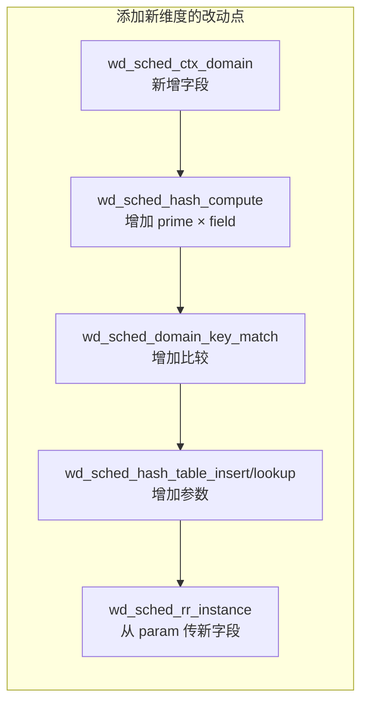

所有改动集中在哈希 key 的处理上，调度策略代码完全不需要修改。

### 12.3 性能优化建议

**选择合适的策略**：
- 单队列业务 → NONE 或 SINGLE（跳过哈希表）
- 通用多队列 → RR（最均衡）
- 高吞吐异步 → HUNGRY（自动扩展 ctx 数量）
- 混合设备 → LOOP（HW 空闲时走 CE）

**配置 ctx 数量**：
- 每个 session 的 idx_cache 最多 16 个 ctx，过多无益
- HW 类型 ctx 不宜过多（硬件队列深度有限）
- CE/SOFT 类型 ctx 可以适当增多（无硬件限制）

**多线程 poll**：
- poll 线程数建议与 skey 数匹配
- 多个 poll 线程同时运行时，注意 `sched_ctx->poll_tid[]` 数组的分配

### 12.4 问题定位思路

| 现象 | 可能原因 | 检查点 |
|------|---------|--------|
| pick_next_ctx 返回 INVALID_POS | idx_cache 无有效 ctx | `valid_count` 是否为 0 |
| 某 ctx 负载极高 | 负载不均 | HUNGRY 策略下 `min_load_idx` 是否正确更新 |
| poll 慢 | skey 数过多或每个 skey 的 ctx 过多 | `wd_sched_poll_skey` 循环次数 |
| 哈希表查询慢 | 链过长 | 检查 `max_chain_length` |
| 内存占用异常 | 域数超出预期 | 检查 `entry_count` |

### 12.5 已知限制

1. **哈希表无 resize 机制**：桶数在创建时固定。如果运行时域数远超 `estimated_entries`，链长增长，查找退化为 O(n)。
3. **Compat filter 非原子性**：过滤过程中持有 skey lock，但其他线程可能在这期间调用 pick。当前设计依赖 session 创建是单线程的实践保证（多线程并非创建需要锁机制优化）。
4. **SEGMENT 链表尾插入 O(n)**：多次向同一域注册 segment 时，需要遍历到链表尾部。初始化场景下可接受，运行时频繁注册需优化。

---

## 附录：关键函数映射表

| 函数 | 所属章节 | 功能简述 |
|------|---------|---------|
| `wd_sched_rr_alloc` | 4/7/9 | 创建调度器，选择策略 |
| `wd_sched_rr_instance` | 4/5 | 注册调度域（4 维 key + ctx 范围） |
| `wd_sched_rr_release` | 9 | 释放所有调度器资源 |
| `wd_sched_hash_table_create` | 4 | 创建哈希表 |
| `wd_sched_hash_table_lookup` | 4 | 按 4 维 key 查询域 |
| `wd_sched_hash_table_insert` | 4 | 插入新域（double-check） |
| `wd_sched_hash_compute` | 4 | 4 维组合哈希函数 |
| `wd_sched_domain_add_segment` | 5 | 向域追加 ctx 范围 |
| `wd_sched_domain_get_next_rr` | 5 | Segment 链表 O(1) RR 轮转 |
| `sched_session_common_init` | 6 | 分配 session key |
| `session_sched_domain_init` | 6 | 预取 sync/async ctx |
| `wd_sched_skey_cache_init` | 6 | 初始化 idx_cache |
| `wd_sched_skey_pick_next` | 6 | idx_cache RR/负载均衡选择 |
| `wd_sched_skey_compat_filter` | 8 | 替换不兼容 ctx |
| `wd_sched_set_param` | 8 | 设算法参数，触发 compat filter |
| `wd_sched_poll_skey` | 6 | 轮询 skey 的 async 域 ctx |
| `sched_get_poll_skey` | 9 | poll 线程分配 skey |

